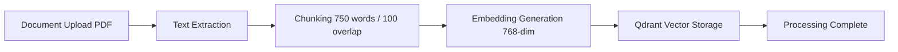

# 🤖 AI & RAG Pipeline Documentation

> *Comprehensive documentation for the AI School Management Platform's multi-provider LLM orchestration, Retrieval-Augmented Generation (RAG), vector embeddings, and prompt engineering.*

---

## 💡 Special Note: Cloud AI Providers vs Local Ollama

> [!IMPORTANT]
> **No Local LLM Required!**
> If you do not have **Ollama** installed on your local machine, or when running in 24/7 Cloud Production (e.g. Render):
> 1. Log into your dashboard and navigate to **AI Settings** (`/settings`).
> 2. Select any Cloud AI Provider such as **Groq** *(Free & Ultra-Fast)*, **OpenAI**, **Google Gemini**, **Anthropic**, **OpenRouter**, **Azure OpenAI**, **DeepSeek**, or **Mistral AI**.
> 3. Enter your API key, click **Verify Connection**, and click **Save Settings**.
> Your API key is encrypted with **AES-256-GCM** in the database. The EduAI Assistant will immediately use your chosen cloud provider for all chat, homework assistance, lesson planning, and RAG operations!

---

## 1. Multi-Provider AI Architecture

The system uses a strategy pattern (`LlmProviderStrategy`) managed by `ProviderRegistry` to support **9 Cloud & Local LLM Providers**:

```java
public interface LlmProviderStrategy {
    String getProviderName();
    boolean isApiKeyRequired();
    String chat(String apiKey, String baseUrl, String model, String prompt, double temperature, int maxTokens);
    boolean verifyConnection(String apiKey, String baseUrl);
    List<String> getModels(String apiKey, String baseUrl);
}
```

### Supported Providers

1. **Groq**: Ultra-fast cloud inference (`llama-3.3-70b-versatile`, `mixtral-8x7b-32768`, `whisper-large-v3-turbo`)
2. **OpenAI**: GPT-4o, GPT-4o-mini, GPT-3.5-turbo (`https://api.openai.com`)
3. **Google Gemini**: Gemini 1.5 Pro, Gemini 1.5 Flash (`https://generativelanguage.googleapis.com`)
4. **Anthropic**: Claude 3.5 Sonnet, Claude 3 Opus (`https://api.anthropic.com`)
5. **OpenRouter**: Unified API routing across 100+ open-source models (`https://openrouter.ai`)
6. **Azure OpenAI**: Enterprise Azure-hosted OpenAI endpoints
7. **DeepSeek**: DeepSeek-V3, DeepSeek-R1 reasoning models (`https://api.deepseek.com`)
8. **Mistral AI**: Mistral Large, Mistral Small, Codestral (`https://api.mistral.ai`)
9. **Ollama**: Local privacy-first LLM runner (`http://localhost:11434`, e.g. `qwen2.5-coder:3b`)

---

## 2. Per-User AI Configuration & AES Encryption

Each user can store their personalized LLM provider preferences in the `user_ai_configs` database table:

- **Service**: `UserAiConfigServiceImpl` (`getUserConfig`, `saveConfig`, `verifyConnection`, `resetToDefault`)
- **AES Field Encryption**: `AesEncryptionConverter` encrypts API keys at the column level with
  **AES-256-GCM** (authenticated encryption, random 12-byte IV per value, `gcm:v1:` prefix) before they
  reach the database. The key comes from `APP_ENCRYPTION_KEY`, must be at least 32 characters, and has
  **no default** — the application refuses to start without it. Values written by older builds
  (AES-128) are still readable, but only while the same secret is in use; rotating the key makes
  previously stored API keys undecryptable and users must re-enter them.
- **Lookup Resolution**: Supports lookup by `username` or `email` (`findByUserUsernameOrUserEmail`).

---

## 3. Prompt Templates

Organized in `com.ai.dashboard.ai.prompt`:

- **`TutorPromptTemplate`**: System prompt for 24/7 AI learning tutor behavior and RAG context grounding.
- **`HomeworkPromptTemplate`**: Step-by-step homework guidance and hints without giving away direct solutions.
- **`QuizPromptTemplate`**: Dynamic multiple-choice quiz generator with option selectors and answer explanations.
- **`LessonPlannerPromptTemplate`**: Outlines structured lesson plans, learning objectives, timing, and classroom activities.
- **`DocumentQAPromptTemplate`**: Enforces strict context-only document Q&A and citation generation.

`com.ai.dashboard.prompt.PromptTemplates` holds the natural-language-to-SQL prompt used by the Ask-AI
page (see the next section for its data scope).

---

## 3a. Natural-language-to-SQL: data scope

The Ask-AI feature (`AiQueryServiceImpl`) queries the **`student` table only**. That table is a
standalone demo dataset — it is not the platform's user roster, and its rows do not correspond to
registered accounts, enrolments, or grades. See the "Two separate student populations" note in
[Database.md](Database.md).

Practical consequences:

- **AI answers will not match dashboard numbers.** "How many students?" via Ask-AI counts `student`
  rows; the dashboard counts `users` with `ROLE_STUDENT`. Both are right about different data.
- The UI states this inline on the Ask-AI page so users are not misled by the discrepancy.

Defence in depth around the generated SQL, in `SqlValidator`:

| Control | Behaviour |
| :--- | :--- |
| Statement type | JSqlParser must parse it as a single `SELECT`; anything else is rejected |
| Table whitelist | `student` only — `users` and every operational table are unreachable |
| Column blocklist | `password`, `password_hash`, `api_key`, `secret`, `token`, `refresh_token` |
| System schemas | `information_schema`, `pg_*`, `mysql`, `sys*`, `performance_schema` rejected |
| Result limits | 200-row cap, 5-second query timeout |

The whitelist is intentionally narrower than the physical schema. It should list only the tables the
system prompt actually describes to the model — every extra entry is surface a prompt-injected query
could exploit.

---

## 4. Embeddings & Vector Search

- **Embedding Model**: `EmbeddingServiceImpl` uses `nomic-embed-text` (768 dimensions).
- **Vector Database**: `QdrantProvider` communicates with Qdrant Cloud or local Qdrant container on port `6333`.
- **Collection Name**: `course_documents` (Cosine distance metric).

---

## 5. Document RAG Pipeline



### Processing Statuses
- `PENDING`: Initial file upload.
- `PROCESSING`: Chunking and embedding generation in progress.
- `COMPLETED`: Indexed in Qdrant and ready for RAG query context retrieval.
- `FAILED`: Document parsing or embedding failure.

---

## 6. Conversation Memory & Token Tracking

- Sessions stored in `conversation_sessions` table (`user_id`, `session_id`, `total_tokens`, `message_count`).
- Messages stored in `chat_messages` table (`role`, `content`, `token_count`, `context_used`).
- Context history limit configured via `ai.memory.context-history-limit` (default: 3 recent turns).