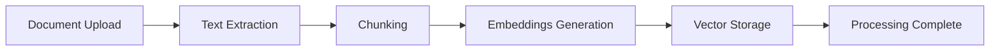

# AI Documentation

## Ollama Integration

The system uses LangChain4j with Ollama for LLM capabilities:

```java
@Bean
public OllamaChatModel ollamaChatModel(OllamaProperties props) {
    return OllamaChatModel.builder()
            .baseUrl(props.getBaseUrl())
            .modelName(props.getModel())
            .temperature(props.getTemperature())
            .timeout(Duration.ofSeconds(props.getTimeout()))
            .build();
}
```

### Configuration
- `ai.ollama.base-url` - Ollama server URL (default: http://localhost:11434)
- `ai.ollama.model` - Model name (default: qwen2.5-coder:3b)
- `ai.ollama.temperature` - Sampling temperature (default: 0.2)
- `ai.ollama.max-tokens` - Maximum response tokens (default: 2048)

## Prompt Templates

All prompts are organized by use case in `com.ai.dashboard.ai.prompt`:

### TutorPromptTemplate
```java
// Builds system prompt for AI Tutor behavior
String systemPrompt = "You are an AI Learning Tutor...";
// Builds contextual prompt with retrieved content
String prompt = buildContextualPrompt(context, question);
```

### HomeworkPromptTemplate
- Generates step-by-step homework guidance
- Formats problems with context and instructions

### QuizPromptTemplate
- Creates multiple-choice questions
- Provides answer explanations

### LessonPlannerPromptTemplate
- Structures lesson plans with objectives
- Includes timing and activities

### DocumentQAPromptTemplate
- Formats document-based Q&A
- Enforces context-only responses

## Embeddings

Embeddings are generated via Ollama's embedding API:

```java
@Service
public class EmbeddingServiceImpl implements EmbeddingService {
    private final OllamaEmbeddingModel embeddingModel;
    
    public List<Float> generateEmbedding(String text) {
        return embeddingModel.embed(text).content().vectorAsFloatList();
    }
}
```

### Configuration
- `ai.ollama.embedding-batch-size` - Batch processing size (default: 10)

## RAG Retrieval

### Vector Search
```java
public List<SearchResult> searchSimilar(List<Float> embedding, int topK) {
    return vectorStoreService.search(embedding, topK);
}
```

### Similarity Threshold
Results are filtered by `ai.ollama.similarity-threshold` (default: 0.7)

### Chunk Size & Overlap
- `ai.ollama.chunk-size` - Words per chunk (default: 750)
- `ai.ollama.chunk-overlap` - Overlap words (default: 100)

## Streaming Responses

The `RagService` supports streaming:

```java
public Stream<RagChatStreamResponse> answerQuestionStream(String question, Long courseId) {
    // Streams tokens instead of waiting for complete response
}
```

## Conversation Memory

### Session Management
- Each user can have multiple conversation sessions
- Sessions stored in `conversation_sessions` table
- Messages stored in `chat_messages` table

### Token Tracking
- Each message tracks token count
- Sessions track total tokens and message count
- History trimming when exceeding `ai.ollama.max-history-tokens`

## Document Processing Pipeline



### Processing Status
- `PENDING` - Initial upload
- `PROCESSING` - Embedding in progress
- `COMPLETED` - Ready for RAG
- `FAILED` - Processing error

## AI Service Flow

```mermaid
sequenceDiagram
    participant User
    participant RagController
    participant RagService
    participant EmbeddingService
    participant VectorStoreService
    participant AIService
    participant Ollama

    User->>RagController: POST /api/rag/chat (question)
    RagController->>RagService: answerQuestion
    RagService->>EmbeddingService: generateEmbedding
    EmbeddingService->>Ollama: GET /api/embeddings
    Ollama-->>EmbeddingService: embedding vector
    RagService->>VectorStoreService: searchSimilar
    VectorStoreService-->>RagService: search results
    RagService->>AIService: chat(prompt)
    AIService->>Ollama: POST /api/chat
    Ollama-->>AIService: response
    AIService-->>RagService: answer
    RagService-->>RagController: response
    RagController-->>User: {answer, sources, confidence}