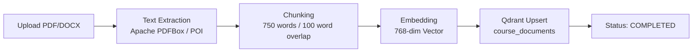

# 🤖 AI & RAG Pipeline Documentation

Enterprise multi-provider LLM orchestration, Retrieval-Augmented Generation (RAG), vector embeddings, and prompt engineering architecture.

---

## 1. Multi-Provider AI Architecture

The system uses a **Strategy Pattern** (`LlmProviderStrategy`) managed by `ProviderRegistry` to support **9 Cloud & Local LLM Providers** via **LangChain4j 0.34.0**.

```java
public interface LlmProviderStrategy {
    String getProviderName();
    boolean isApiKeyRequired();
    String chat(String apiKey, String baseUrl, String model, String prompt, double temperature, int maxTokens);
    boolean verifyConnection(String apiKey, String baseUrl);
    List<String> getModels(String apiKey, String baseUrl);
}
```

### Supported Providers
1. **Groq**: Ultra-fast cloud inference (`llama-3.3-70b-versatile`, `mixtral-8x7b-32768`)
2. **OpenAI**: GPT-4o, GPT-4o-mini, GPT-3.5-turbo
3. **Google Gemini**: Gemini 1.5 Pro, Gemini 1.5 Flash
4. **Anthropic**: Claude 3.5 Sonnet, Claude 3 Opus
5. **OpenRouter**: Unified API routing across 100+ models
6. **Azure OpenAI**: Enterprise Azure-hosted endpoints
7. **DeepSeek**: DeepSeek-V3, DeepSeek-R1 reasoning models
8. **Mistral AI**: Mistral Large, Mistral Small, Codestral
9. **Ollama**: Optional local runner (`http://localhost:11434`, e.g. `qwen2.5-coder:3b`)

*Users can configure and verify their preferred cloud provider in **AI Settings** (`/settings`) without needing local GPU hardware.*

---

## 2. Per-User AI Configuration & Encryption

Each user's preferences are stored in the `user_ai_configs` table:

- **AES-256-GCM Encryption**: `AesEncryptionConverter` encrypts API keys at the column level with a random 12-byte IV (`gcm:v1:` prefix). Key source: `APP_ENCRYPTION_KEY` (minimum 32 characters, required at startup).
- **Service Layer**: `UserAiConfigServiceImpl` manages configuration lookup, testing connections against live provider APIs, and key masking for UI display.

---

## 3. Prompt Engineering

Structured prompts located in `com.ai.dashboard.ai.prompt`:

- **`TutorPromptTemplate`**: Socratic learning assistant grounded in verified course context.
- **`HomeworkPromptTemplate`**: Guidance and hints without revealing direct answers.
- **`QuizPromptTemplate`**: Formats multiple-choice questions with answer keys and rationale.
- **`LessonPlannerPromptTemplate`**: Generates curriculum objectives, timing, and classroom activities.
- **`DocumentQAPromptTemplate`**: Enforces strict context-only answers with citations.

---

## 4. Natural-Language-to-SQL (Ask-AI)

Ask-AI queries the **`student` table only** (a standalone demo dataset with name, course, subject, fee, address). It is completely isolated from the live `users` roster.

### `SqlValidator` Safety Controls

| Control | Policy |
| :--- | :--- |
| **Statement Type** | JSqlParser AST analysis; must be a single `SELECT` statement |
| **Table Whitelist** | `student` table only; all other tables rejected |
| **Column Blocklist** | Rejects queries referencing `password`, `hash`, `token`, `secret`, `api_key` |
| **System Schemas** | Rejects `information_schema`, `pg_*`, `mysql`, `sys*` |
| **Execution Limits** | Maximum 200 rows; 5-second query timeout on a read-only cursor |

---

## 5. Embeddings & Vector Search

- **Framework**: LangChain4j 0.34.0
- **Embedding Model**: `EmbeddingServiceImpl` using `nomic-embed-text` (**768 dimensions**)
- **Vector Store**: `QdrantProvider` connecting to Qdrant Cloud or local instance (`6333`)
- **Collection**: `course_documents` (Cosine distance metric)
- **Floor Threshold**: Assistant declines to answer rather than hallucinate when vector similarity falls below the threshold.

---

## 6. Document RAG Pipeline



### RAG Chat Execution
1. User question embedded into 768-dimensional vector.
2. Qdrant performs top-5 semantic similarity retrieval.
3. Chunks + question injected into LLM prompt context.
4. Response streamed token-by-token via Server-Sent Events (SSE).
5. Document citations appended to message.

---

## 7. Session Memory & Tracking

- Context history window tracks the last **3 conversation turns** (`ai.memory.context-history-limit`).
- Token usage recorded in `conversation_sessions` and `chat_messages` tables.

---

## 8. AI Feature Routes

| Feature | Route | Description |
| :--- | :--- | :--- |
| **AI RAG Chat** | `/chat` | Context-grounded assistant with SSE streaming (also global floating widget) |
| **Ask-AI** | `/ask-ai` | Natural-language query generator for student demo dataset |
| **AI Homework Helper** | `/ai/homework` | Step-by-step problem guidance |
| **AI Quiz Generator** | `/ai/quiz` | Automated topic assessment generator |
| **AI Lesson Planner** | `/ai/lesson-plan` | Structured syllabus and lesson scheduling |
| **Knowledge Library** | `/knowledge` | Syllabus and textbook ingestion for RAG |

---

## 9. Model Context Protocol (MCP)

The AI layer also exposes its capabilities to external AI clients (Claude Desktop, Cursor, agents) via the Model Context Protocol. See **[MCP.md](MCP.md)** for tool schemas, RBAC matrix, and agentic orchestration.