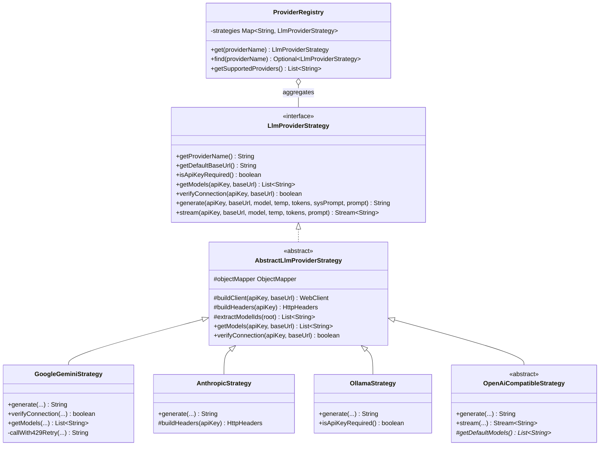
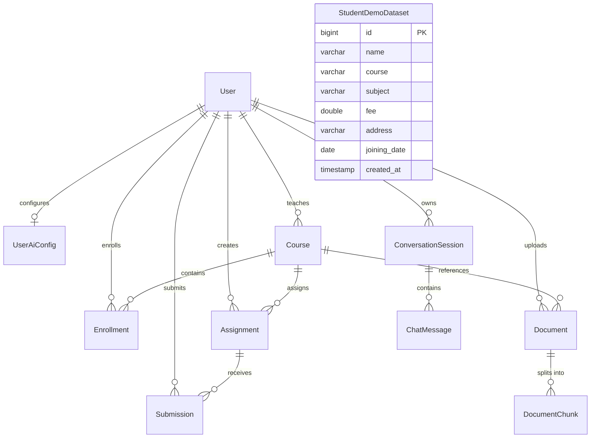
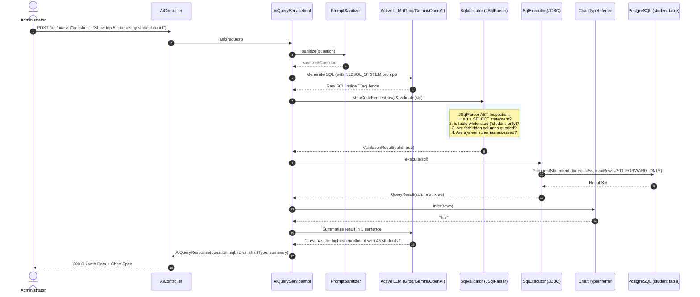
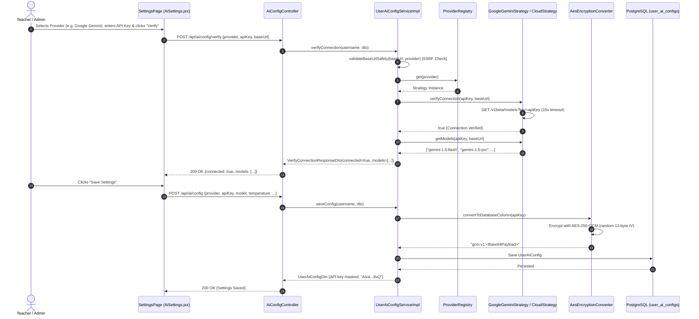
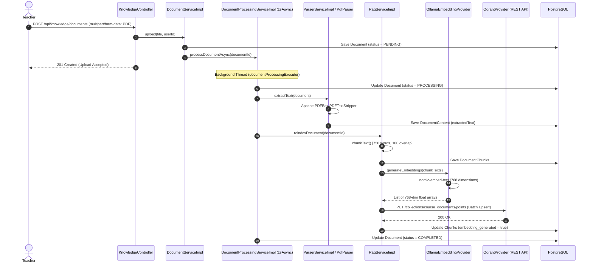
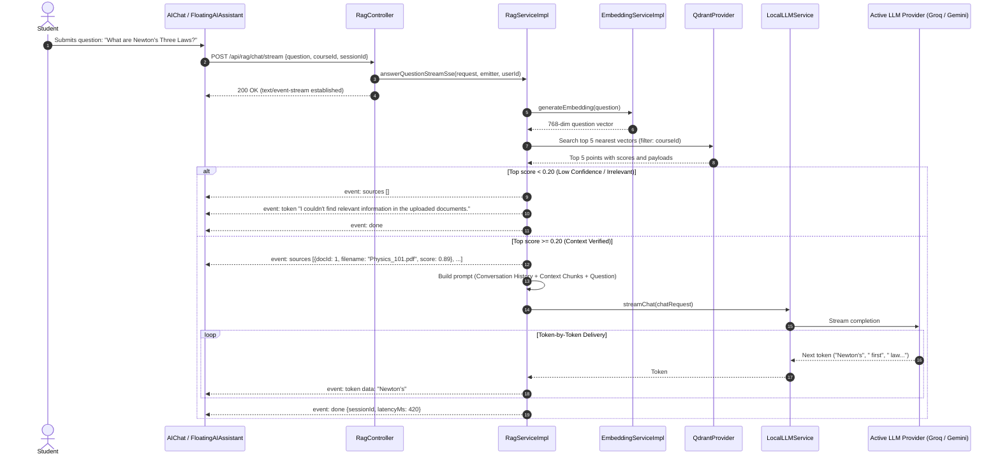
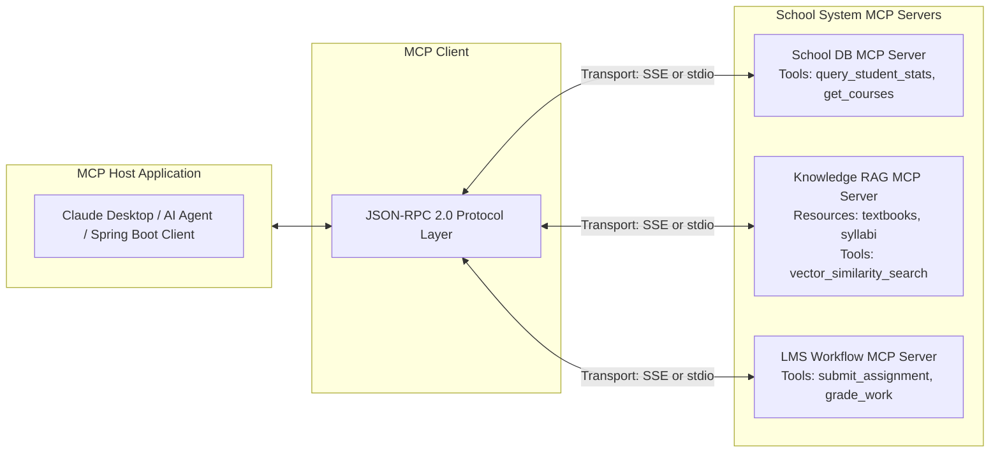

# 🎓 AI School Management & Analytics Platform (EduAI OS)
## Comprehensive Technical Architecture, System Design (HLD & LLD), Execution Flows & AI Integration Master Guide

> **Target Audience:** Technical Interview Preparation for Full-Stack, AI Engineering, and Distributed Systems roles.  
> **Repository:** `Dheerajdvn/AI-School-Management-System`  
> **Author / Original Engineer:** Dheeraj DVN  
> **Document Purpose:** An exhaustive, production-grade reference covering High-Level Design (HLD), Low-Level Design (LLD), Sequence Flows, Component Implementation, and granular AI/RAG integration mechanics down to every algorithm, formula, and parameter.

---

## 📑 Table of Contents

1. [Project Overview & Architecture Philosophy](#1-project-overview--architecture-philosophy)
2. [Complete Technology Stack Matrix](#2-complete-technology-stack-matrix)
3. [High-Level System Design (HLD)](#3-high-level-system-design-hld)
   - 3.1 [Global Architecture Diagram](#31-global-architecture-diagram)
   - 3.2 [Subsystem Decomposition & Boundaries](#32-subsystem-decomposition--boundaries)
   - 3.3 [Cloud Infrastructure & Hosting Topology](#33-cloud-infrastructure--hosting-topology)
4. [Low-Level Software Design (LLD)](#4-low-level-software-design-lld)
   - 4.1 [Core Object-Oriented Design Patterns](#41-core-object-oriented-design-patterns)
   - 4.2 [Complete Class Hierarchy & Interface Specifications](#42-complete-class-hierarchy--interface-specifications)
   - 4.3 [Relational & Vector Data Schemas (PostgreSQL & Qdrant)](#43-relational--vector-data-schemas-postgresql--qdrant)
   - 4.4 [The Critical "Two Student Populations" Architecture Decision](#44-the-critical-two-student-populations-architecture-decision)
5. [Granular AI Integration Mechanics (Interview Core)](#5-granular-ai-integration-mechanics-interview-core)
   - 5.1 [Multi-Provider LLM Strategy Engine (9 Providers)](#51-multi-provider-llm-strategy-engine-9-providers)
   - 5.2 [Dynamic Provider Resolution & Execution Context](#52-dynamic-provider-resolution--execution-context)
   - 5.3 [Document Ingestion, Parsing & Chunking Pipeline](#53-document-ingestion-parsing--chunking-pipeline)
   - 5.4 [Vector Embeddings & Deterministic Fallback Math](#54-vector-embeddings--deterministic-fallback-math)
   - 5.5 [Qdrant Vector Storage, Filtering & Cosine Similarity](#55-qdrant-vector-storage-filtering--cosine-similarity)
   - 5.6 [RAG Retrieval, Hallucination Guards & Token SSE Streaming](#56-rag-retrieval-hallucination-guards--token-sse-streaming)
   - 5.7 [Natural-Language-to-SQL (NL2SQL) Engine & JSqlParser Guardrails](#57-natural-language-to-sql-nl2sql-engine--jsqlparser-guardrails)
   - 5.8 [Chart Type Inference Heuristics](#58-chart-type-inference-heuristics)
   - 5.9 [Prompt Engineering & Prompt Sanitizer (Injection Defense)](#59-prompt-engineering--prompt-sanitizer-injection-defense)
6. [Security, Privacy & Infrastructure Hardening](#6-security-privacy--infrastructure-hardening)
   - 6.1 [AES-256-GCM Field-Level Authenticated Encryption](#61-aes-256-gcm-field-level-authenticated-encryption)
   - 6.2 [SSRF Defense & IP Whitelisting / Metadata Blocking](#62-ssrf-defense--ip-whitelisting--metadata-blocking)
   - 6.3 [JWT Stateless Auth & Redis Token Bucket Rate Limiting](#63-jwt-stateless-auth--redis-token-bucket-rate-limiting)
7. [End-to-End Architectural Flows & Sequence Diagrams](#7-end-to-end-architectural-flows--sequence-diagrams)
   - Flow 1: Per-User AI Configuration & Verification
   - Flow 2: Asynchronous Document Ingestion, Chunking & Indexing
   - Flow 3: RAG Query Execution with Real-Time SSE Token Streaming
   - Flow 4: Natural-Language-to-SQL Analytical Pipeline
   - Flow 5: Floating AI Assistant (Public Marketing vs Authenticated Student Mode)
8. [Comprehensive Component & Package Breakdown](#8-comprehensive-component--package-breakdown)
9. [Senior Interview Preparation: 25+ High-Impact Questions & Model Answers](#9-senior-interview-preparation-25-high-impact-questions--model-answers)
10. [Model Context Protocol (MCP) Deep-Dive & Architecture Roadmap](#10-model-context-protocol-mcp-deep-dive--architecture-roadmap)
11. [LangChain4j Declarative Services, Observability & Real-Time Infrastructure](#11-langchain4j-declarative-services-observability--real-time-infrastructure)
12. [Production Realities, Edge Cases & Honest Architecture Gotchas](#12-production-realities-edge-cases--honest-architecture-gotchas)

---

## 1. Project Overview & Architecture Philosophy

### 1.1 What the Platform Is
The **AI School Management & Analytics Platform (EduAI OS)** is a full-stack, enterprise-grade educational Enterprise Resource Planning (ERP) platform tightly integrated with an autonomous Generative AI & Retrieval-Augmented Generation (RAG) subsystem.

It solves three distinct educational operational needs:
1. **Academic ERP Workflows:** Role-based operations across 5 educational personas (**Super Admin, School Admin, Principal, Teacher, Student**) managing schools, courses, enrollments, assignments, submissions, and gradebooks.
2. **Textbook & Syllabus-Grounded AI Tutoring (RAG):** Real-time vector search across uploaded educational course documents (PDFs, DOCX, Markdown, TXT) producing accurate, citation-backed answers with strict similarity score cutoffs to prevent hallucinations.
3. **Conversational Natural-Language Analytics (NL-to-SQL):** A natural-language query interface allowing administrators and teachers to ask complex analytical questions in plain English (e.g., *"Show average fee by course"* or *"Top five courses by enrollment"*), converting them dynamically into AST-validated, read-only SQL, executing them against PostgreSQL, and automatically determining the ideal visualization chart (Bar, Line, Pie, Metric, or Table).

### 1.2 Architecture Philosophy
- **Plug-and-Play LLM Strategy:** The system never locks users or institutions into a single AI vendor. Users can run completely offline via local Ollama models (`qwen2.5-coder:3b`, `llama3.2`) for 100% data privacy, or plug in any of 8 commercial cloud providers (Groq, OpenAI, Google Gemini, Anthropic Claude, Azure OpenAI, DeepSeek, Mistral AI, OpenRouter) via their personal API keys.
- **Strict Defense-in-Depth:** Zero-trust architecture around LLM outputs. Model-generated SQL never touches JDBC directly without AST parsing, table whitelisting, system schema rejection, and execution resource caps. User API keys are encrypted at rest with AES-256-GCM. Outgoing HTTP requests to user-specified LLM endpoints are guarded against Server-Side Request Forgery (SSRF).
- **Graceful Degradation & High Resilience:** Every AI subsystem features deterministic heuristic fallbacks. If Ollama or cloud LLMs are unreachable, the system falls back to semantic hash projections for vector embeddings and intelligent SQL heuristic patterns, ensuring zero unhandled 500 crashes.

---

## 2. Complete Technology Stack Matrix

| Tier / Domain | Technology / Library | Version / Spec | Purpose in System |
| :--- | :--- | :--- | :--- |
| **Backend Core** | Java | 17 LTS | Core application runtime |
| **Backend Framework** | Spring Boot | 3.5.0-M1 | REST framework, DI, lifecycle management |
| **Data Persistence** | Spring Data JPA / Hibernate | 6.x | ORM, JPA repositories, entity lifecycle |
| **Relational Database** | PostgreSQL (Neon Cloud) | 16 | ACID operational storage, transactional tables |
| **In-Memory Cache** | Upstash Redis | Redis 7 (TLS) | Refresh token storage, IP rate-limiting token buckets |
| **Vector Database** | Qdrant Cloud / Local Docker | REST API (v1.x) | 768-dimensional dense vector indexing & Cosine search |
| **SQL Parser** | JSqlParser | 4.9 | Abstract Syntax Tree (AST) analysis for LLM SQL validation |
| **Document Parsers** | Apache PDFBox | 3.0.2 | Text extraction from academic PDF coursebooks |
| | Apache POI (POI-OOXML) | 5.2.5 | Text extraction from `.docx` assignment/syllabus files |
| **Reactive Client** | Spring WebFlux / WebClient | Reactor Netty | Non-blocking HTTP calls to 9 LLM APIs and Qdrant |
| **Security & Cryptography** | Spring Security 6, JJWT | 0.12.5 | Stateless JWT authentication, role guards (`@PreAuthorize`) |
| | Java Cryptography Extension (JCE) | AES-256-GCM | Column-level API key authenticated encryption |
| **API Documentation** | Springdoc OpenAPI / Swagger UI | 2.5.0 | Interactive API documentation (`/swagger-ui.html`) |
| **Observability** | Spring Boot Actuator, Micrometer | Prometheus | Metrics endpoint, custom health indicators (Qdrant, Ollama, Redis) |
| **Frontend Framework** | React | 18.3.1 | Single-Page Application (SPA) reactive UI |
| **Build Tool** | Vite | 5.4.2 | Ultra-fast HMR and frontend bundling |
| **Routing** | React Router DOM | 6.26.1 | Client-side routing across 105 routes |
| **Styling & Design System**| Bootstrap 5 + Vanilla CSS Variables | 5.3.3 + Custom CSS | Design system with dual light/dark themes, glassmorphism |
| **Data Visualization** | Chart.js & react-chartjs-2 | 4.4.4 / 5.2.0 | Dynamic charts (Bar, Line, Pie, Doughnut) for AI queries |
| **HTTP Client** | Axios | 1.7.5 | Interceptor-driven HTTP calls with JWT refresh logic |
| **Deployment / CI** | Render (Backend), Vercel (Frontend) | Cloud Serverless | Cloud hosting with GitHub Actions keep-alive crons |

---

## 3. High-Level System Design (HLD)

### 3.1 Global Architecture Diagram

```mermaid
graph TB
    subgraph ClientTier [Frontend Presentation Tier - React 18 / Vite on Vercel]
        SPA[React 18 Single Page Application]
        AuthCtx[AuthContext & JWT Store]
        ThemeCtx[ThemeContext - Light / Dark]
        FloatAI[Floating AI Assistant - Public / Auth]
        AskAIPage[Ask-AI NL2SQL Interactive Explorer]
        KnowledgeUI[Knowledge Center & Document Upload]
        Portals[Role Portals: Student / Teacher / Principal / Admin]
    end

    subgraph SecurityTier [Gateway & Security Interceptors - Spring Boot on Render]
        RateFilter[RateLimitingFilter - Upstash Redis Bucket]
        CorsFilter[CORS Filter - Whitelist Origins]
        JwtFilter[JwtAuthenticationFilter - Bearer Token]
        PreAuth[Method Security - @PreAuthorize Evaluator]
    end

    subgraph CoreBackend [Spring Boot 3.5 Application Layer]
        RestControllers[REST Controllers: Ai, Rag, Knowledge, Auth, Course, etc.]
        
        subgraph AISubsystem [Dedicated AI Subsystem]
            LocalLLM[LocalLLMService - AIService]
            RagServ[RagServiceImpl - RAG Pipeline]
            AiQuery[AiQueryServiceImpl - NL2SQL Orchestrator]
            SqlVal[SqlValidator - JSqlParser AST Gatekeeper]
            SqlExec[SqlExecutor - Read-Only JDBC Cursor]
            EmbedServ[EmbeddingServiceImpl / OllamaEmbeddingProvider]
            DocProcess[DocumentProcessingServiceImpl - @Async Worker]
            PromptEng[PromptBuilder & PromptTemplateRegistry]
            Sanitizer[PromptSanitizer - Injection Guard]
        end

        subgraph ProviderStrategyTier [LLM Provider Strategy Tier]
            PRegistry[ProviderRegistry]
            GroqStrat[Groq Strategy]
            OpenAIStrat[OpenAI Strategy]
            GeminiStrat[Google Gemini Strategy]
            AnthropicStrat[Anthropic Strategy]
            DeepSeekStrat[DeepSeek Strategy]
            MistralStrat[Mistral AI Strategy]
            AzureStrat[Azure OpenAI Strategy]
            OpenRouterStrat[OpenRouter Strategy]
            OllamaStrat[Ollama Strategy]
        end

        subgraph CoreServices [Business Services Layer]
            UserServ[UserService]
            CourseServ[CourseService]
            AssignServ[AssignmentService]
            DocServ[DocumentService]
            UserAiServ[UserAiConfigService]
        end
    end

    subgraph DataStorageTier [Persistence & Vector Infrastructure]
        Postgres[(Neon PostgreSQL 16 - Relational DB)]
        RedisCache[(Upstash Redis - Rate Limits & Refresh Tokens)]
        QdrantDB[(Qdrant Cloud - 768-dim Vector Store)]
        DocDisk[(Local / Cloud Storage - Uploaded Files)]
    end

    subgraph ExternalLLMTier [External Cloud & Local LLM Endpoints]
        ExtGroq["Groq Cloud API (Llama 3.3 70B)"]
        ExtOpenAI["OpenAI API (GPT-4o, GPT-4o-mini)"]
        ExtGemini["Google Gemini API (Gemini 1.5/2.0 Flash)"]
        ExtAnthropic["Anthropic Claude API (Claude 3.5 Sonnet)"]
        ExtOther["DeepSeek / Mistral / Azure / OpenRouter"]
        LocalOllama["Local Ollama Daemon (localhost:11434)"]
    end

    %% Wiring
    SPA -->|HTTPS REST & SSE / Bearer JWT| SecurityTier
    SecurityTier --> RestControllers
    RestControllers --> CoreServices
    RestControllers --> AISubsystem

    AISubsystem --> PRegistry
    PRegistry --> GroqStrat & OpenAIStrat & GeminiStrat & AnthropicStrat & DeepSeekStrat & MistralStrat & AzureStrat & OpenRouterStrat & OllamaStrat

    GroqStrat --> ExtGroq
    OpenAIStrat --> ExtOpenAI
    GeminiStrat --> ExtGemini
    AnthropicStrat --> ExtAnthropic
    DeepSeekStrat & MistralStrat & AzureStrat & OpenRouterStrat --> ExtOther
    OllamaStrat --> LocalOllama

    EmbedServ -->|POST /api/embed| LocalOllama
    AISubsystem -->|REST /collections/points| QdrantDB
    CoreServices --> Postgres
    SqlExec -->|Read-Only SELECT 5s timeout| Postgres
    RateFilter --> RedisCache
    DocServ --> DocDisk
```



### 3.2 Subsystem Decomposition & Boundaries

1. **Frontend Presentation Subsystem (`frontend/src/`):**
   - React 18 SPA built with Vite.
   - Houses role-gated dashboards, dynamic Chart.js visualizations, the floating AI assistant widget, and the knowledge document management UI.
   - Communicates via Axios with an HTTP interceptor handling automatic token attachment and 401 refresh token cycling.

2. **Security & Ingress Gateway Subsystem (`backend/src/main/java/com/ai/dashboard/config/` & `security/`):**
   - **`RateLimitingFilter`:** Intercepts requests before reaching controllers. Uses Upstash Redis to enforce IP/user request token buckets to prevent API abuse and DoS.
   - **`JwtAuthenticationFilter`:** Parses `Authorization: Bearer <token>`, validates HMAC-SHA signatures, extracts user credentials, and populates Spring's `SecurityContextHolder`.
   - **`@RestControllerAdvice` (`GlobalExceptionHandler`):** Centralizes error responses, mapping domain exceptions (`ResourceNotFoundException`, `UnsafeSqlException`, `AiServiceException`) into uniform `ApiResponse<T>` envelopes.

3. **Multi-Provider LLM Abstraction Subsystem (`com.ai.dashboard.ai.provider`):**
   - Strategy Pattern implementation decoupled from Spring's business controllers.
   - Dispatches prompts dynamically to any of 9 providers based on user preferences stored in the database.

4. **Vector Retrieval & RAG Subsystem (`com.ai.dashboard.ai.rag`, `embedding`, `vector`):**
   - Manages text extraction (PDFBox, POI), 750-word sliding window chunking, 768-dim vector embedding generation, Qdrant indexing, and similarity search.
   - Emits real-time token streams via Spring `SseEmitter`.

5. **Natural-Language-to-SQL Subsystem (`com.ai.dashboard.service.impl.AiQueryServiceImpl` & `validator`):**
   - Converts natural language queries into SQL.
   - Employs JSqlParser to inspect the Abstract Syntax Tree (AST), rejecting any query that is not a single `SELECT` statement on the whitelisted `student` table.
   - Executes queries through a forward-only read-only JDBC cursor capped at 200 rows and 5 seconds.

### 3.3 Cloud Infrastructure & Hosting Topology

- **Frontend:** Vercel Global Edge Network serving the compiled Vite bundle with edge caching.
- **Backend API:** Render Web Service (Spring Boot Docker container).
- **Relational Storage:** Neon Serverless PostgreSQL with connection pooling (HikariCP, max pool size 5 in production).
- **In-Memory Cache:** Upstash Serverless Redis via TLS connection (`rediss://`).
- **Vector DB:** Qdrant Cloud managed cluster running over HTTPS REST (port 6333).
- **Keep-Alive Cron:** A GitHub Actions workflow (`.github/workflows/keep-alive.yml`) sends an automated `GET /api/ai/health` ping every 5 minutes to prevent Render's free tier instance from spinning down.

---

## 4. Low-Level Software Design (LLD)

### 4.1 Core Object-Oriented Design Patterns



1. **Strategy Pattern (`LlmProviderStrategy`):**
   - Decouples LLM invocation from business logic. Every provider implements `generate()`, `stream()`, `getModels()`, and `verifyConnection()`.
2. **Registry Pattern (`ProviderRegistry`):**
   - Spring constructor-injects `List<LlmProviderStrategy> allStrategies`. The registry maps them into an immutable `Map<String, LlmProviderStrategy>` for $O(1)$ runtime lookup by provider name.
3. **Template Method Pattern (`AbstractLlmProviderStrategy` & `OpenAiCompatibleStrategy`):**
   - Base classes define the common HTTP WebClient lifecycle, connection pooling, model JSON extraction, and error parsing. Subclasses only supply provider-specific HTTP headers (e.g. `x-api-key`, `anthropic-version`) or request body shapes.
4. **Builder Pattern:**
   - Applied ubiquitously across DTOs and value objects (`RagChatResponse.builder()`, `StoredDocument.builder()`, `PromptBuildRequest.builder()`, `AiQueryResponse.builder()`).
5. **Attribute Converter Pattern (`AesEncryptionConverter`):**
   - Implements JPA `AttributeConverter<String, String>` to intercept sensitive API key strings before persistence, transparently applying AES-256-GCM encryption on write and decryption on read.

### 4.2 Complete Class Hierarchy & Interface Specifications

#### A. Provider Strategy Layer
- **`LlmProviderStrategy.java`:** Interface contract.
- **`AbstractLlmProviderStrategy.java`:** Base class configuring a shared Reactor Netty `HttpClient` with a connection pool of 50 connections, 15-second connect timeout, and 120-second response timeout.
- **`OpenAiCompatibleStrategy.java`:** Shared abstraction for OpenAI, Groq, DeepSeek, Mistral, and OpenRouter, implementing the standard `/v1/chat/completions` JSON envelope:
  ```json
  {
    "model": "...",
    "messages": [
      {"role": "system", "content": "..."},
      {"role": "user", "content": "..."}
    ],
    "temperature": 0.2,
    "max_tokens": 2048
  }
  ```
- **`GoogleGeminiStrategy.java`:** Direct implementation for Google Gemini's distinct API format (`POST /v1beta/models/{model}:generateContent?key={apiKey}`), using `system_instruction` and `contents.parts.text`. Includes custom HTTP 429 exponential backoff logic.
- **`AnthropicStrategy.java`:** Direct implementation for Claude messages API (`POST /v1/messages`), injecting `x-api-key` and `anthropic-version: 2023-06-01`.
- **`OllamaStrategy.java`:** Local runner adapter invoking `POST /api/generate` and `GET /api/tags` with no API key requirement.

#### B. Prompt Engine Layer (`com.ai.dashboard.ai.prompt`)
- **`PromptTemplate.java`:** Interface with `getType()`, `buildSystemPrompt()`, and `buildUserPrompt(PromptBuildRequest)`.
- **`PromptTemplateRegistry.java`:** Maps enum `PromptType` (`TUTOR`, `HOMEWORK`, `QUIZ`, `LESSON_PLANNER`, `DOCUMENT_QA`, `SQL_GENERATOR`) to its template bean.
- **`PromptBuilder.java`:** Assembles variable injections into parameterized templates, producing a finalized `PromptMessage(systemPrompt, userPrompt)`.

### 4.3 Relational & Vector Data Schemas (PostgreSQL & Qdrant)

#### Relational Database Schema (PostgreSQL via JPA)



1. **`users` Table:**
   - Columns: `id` (BIGINT PK), `username` (VARCHAR 50 UNIQUE), `email` (VARCHAR 100 UNIQUE), `password` (BCrypt VARCHAR 255), `roles` (VARCHAR SET: `ROLE_ADMIN`, `ROLE_TEACHER`, `ROLE_STUDENT`, etc.), `enabled` (BOOLEAN), `created_at`, `updated_at`.
   - Indexes: `idx_users_username`, `idx_users_email`, `idx_users_enabled`.

2. **`user_ai_configs` Table:**
   - Columns: `id` (BIGINT PK), `user_id` (BIGINT FK -> `users.id` UNIQUE), `provider` (VARCHAR 50), `api_key` (VARCHAR 1024, AES-256-GCM encrypted), `base_url` (VARCHAR 255), `model` (VARCHAR 100), `temperature` (DOUBLE), `max_tokens` (INT), `streaming_enabled` (BOOLEAN), `ai_suggestions_enabled` (BOOLEAN), `is_connected` (BOOLEAN), `last_verified_at` (TIMESTAMP).
   - Indexes: `idx_user_ai_config_user_id`.

3. **`documents` Table:**
   - Columns: `id` (BIGINT PK), `filename` (UUID VARCHAR 255), `original_filename` (VARCHAR 255), `content_type` (VARCHAR 100), `file_size` (BIGINT), `storage_path` (VARCHAR 500), `document_type` (ENUM: `SYLLABUS`, `TEXTBOOK`, `NOTES`, `ASSIGNMENT`), `processing_status` (ENUM: `PENDING`, `PROCESSING`, `COMPLETED`, `FAILED`), `course_id` (BIGINT FK -> `courses.id`), `uploaded_by` (BIGINT FK -> `users.id`), `upload_time` (TIMESTAMP).

4. **`document_chunks` Table:**
   - Columns: `id` (BIGINT PK), `document_id` (BIGINT FK -> `documents.id`), `chunk_index` (INT), `content` (TEXT), `token_count` (INT), `embedding_generated` (BOOLEAN), `created_at` (TIMESTAMP).
   - Indexes: `idx_doc_chunks_doc_id`, `idx_doc_chunks_embedding_gen`.

5. **`conversation_sessions` & `chat_messages` Tables:**
   - `conversation_sessions`: `id`, `session_id` (UUID VARCHAR 64 UNIQUE), `user_id` (BIGINT FK), `title` (VARCHAR 255), `message_count` (INT), `total_tokens` (INT), `created_at`, `updated_at`.
   - `chat_messages`: `id`, `session_id` (VARCHAR 64), `role` (VARCHAR 20: `USER`, `ASSISTANT`, `SYSTEM`), `content` (TEXT), `token_count` (INT), `context_used` (TEXT), `created_at`.

#### Vector Database Schema (Qdrant Cloud / Local REST)
- **Collection Name:** `course_documents`
- **Vector Dimension:** `768` (matching `nomic-embed-text`)
- **Distance Metric:** `Cosine`
- **Point Payload Schema:**
  ```json
  {
    "id": "uuid-string (deterministic or random)",
    "vector": [0.0123, -0.0456, ..., 0.0789], // 768 floats
    "payload": {
      "document_id": 42,
      "chunk_id": 3,
      "filename": "Calculus_Early_Transcendentals.pdf",
      "course_id": 101,
      "uploaded_by": 5,
      "document_type": "TEXTBOOK"
    }
  }
  ```

### 4.4 The Critical "Two Student Populations" Architecture Decision

A pivotal system design nuance of this platform is the existence of **two completely isolated student populations**:

| Feature / Attribute | `users` Table (Role: `ROLE_STUDENT`) | `student` Table (Standalone Analytical Dataset) |
| :--- | :--- | :--- |
| **Purpose** | Operational user identity for authentication, submissions, and grades. | Standalone demo dataset for Natural-Language-to-SQL analytics. |
| **Foreign Keys** | Heavily connected: referenced by `enrollments`, `submissions`, `documents`. | **Zero foreign keys.** It is completely decoupled from all application tables. |
| **Populated By** | User signups, CSV roster imports, admin user creation. | Database seeding scripts (`data.sql` / demo fixtures). |
| **Accessible By** | Academic services (`EnrollmentService`, `GradeService`, `UserService`). | **`AiQueryServiceImpl` and Ask-AI only.** |
| **Security Isolation** | **Never exposed to AI.** `SqlValidator` explicitly blocks access. | Whitelisted in `SqlValidator.ALLOWED_TABLES`. |

> **Interview Talking Point:**  
> *"Why not let the AI query the real `users` table?"*  
> If an LLM is granted access to the operational `users` table, an attacker could use prompt injection to execute queries like:  
> `SELECT username, password, email FROM users WHERE roles LIKE '%ADMIN%';`  
> By restricting the NL-to-SQL feature to an isolated `student` demo table, the system establishes a physical data firewall. Even if an attacker completely bypasses the prompt sanitizer, the database cursor has no permissions or schema awareness to view real user accounts, password hashes, or sensitive tokens.

---

## 5. Granular AI Integration Mechanics (Interview Core)

### 5.1 Multi-Provider LLM Strategy Engine (9 Providers)

The platform supports 9 distinct LLM providers via `ProviderRegistry`:

```text
com.ai.dashboard.ai.provider.impl:
├── AbstractLlmProviderStrategy (Base WebClient + Connection Pool)
├── OpenAiCompatibleStrategy (OpenAI, Groq, DeepSeek, Mistral, OpenRouter)
├── GoogleGeminiStrategy (Custom Gemini REST API + 429 Backoff)
├── AnthropicStrategy (Claude Messages API)
├── OllamaStrategy (Local Ollama Engine)
└── AzureOpenAIStrategy (Azure-hosted endpoints)
```

#### Provider Comparison Matrix

| Provider | Default Base URL | Auth Mechanism | Primary Production Models | Special Implementation Detail |
| :--- | :--- | :--- | :--- | :--- |
| **Groq** | `https://api.groq.com/openai/v1` | `Bearer <key>` | `llama-3.3-70b-versatile`, `mixtral-8x7b-32768` | Ultra-fast inference on LPU chips (sub-500ms TTFT) |
| **OpenAI** | `https://api.openai.com/v1` | `Bearer <key>` | `gpt-4o`, `gpt-4o-mini`, `o1-mini` | Standard OpenAI compatible schema |
| **Google Gemini** | `https://generativelanguage.googleapis.com` | `?key=<key>` (Query Param) | `gemini-1.5-flash`, `gemini-1.5-pro`, `gemini-2.0-flash` | Custom JSON body (`contents.parts.text`), regex 429 backoff parser |
| **Anthropic** | `https://api.anthropic.com` | `x-api-key` header | `claude-3-5-sonnet-20241022`, `claude-3-haiku` | Custom headers (`anthropic-version: 2023-06-01`), system prompt at top level |
| **DeepSeek** | `https://api.deepseek.com` | `Bearer <key>` | `deepseek-chat`, `deepseek-reasoner` | OpenAI-compatible endpoint |
| **Mistral AI** | `https://api.mistral.ai/v1` | `Bearer <key>` | `mistral-small-latest`, `codestral-latest` | OpenAI-compatible endpoint |
| **Azure OpenAI** | User Resource URL | `api-key` header | Custom deployed models (`gpt-4o`) | Uses Azure deployment paths |
| **OpenRouter** | `https://openrouter.ai/api/v1` | `Bearer <key>` | `meta-llama/llama-3.3-70b-instruct` | Unified API router across open-source weights |
| **Ollama** | `http://localhost:11434` | None (Local) | `qwen2.5-coder:3b`, `llama3.2:3b` | 100% offline local privacy mode (`/api/generate`) |

#### Google Gemini 429 Rate Limit Backoff Algorithm
Free-tier Gemini keys face a strict 15-20 requests/minute quota. `GoogleGeminiStrategy.java` implements an automatic backoff retry loop up to 4 attempts:
1. When a `WebClientResponseException` with HTTP 429 is caught, the response body is analyzed with regex:
   ```java
   Pattern regex = Pattern.compile("(\"retryDelay\"\\s*:\\s*\"|retry in\\s*)([0-9.]+)(s|ms)", Pattern.CASE_INSENSITIVE);
   ```
2. If a delay (e.g. `23.5s`) is parsed, the thread backs off for `(delay + 1.0) * 1000` ms.
3. Otherwise, it defaults to exponential backoff: `attempt * 2000L` ms.
4. After 4 failed attempts, it throws a user-friendly exception: *"Google Gemini rate limit reached. Please wait 30 seconds before asking your next question."*

### 5.2 Dynamic Provider Resolution & Execution Context

Both `LocalLLMService` (chat) and `AiQueryServiceImpl` (NL2SQL) dynamically resolve the active provider on a **per-user, per-request basis** via `resolveGenerationContext()`:

```java
private record GenerationContext(LlmProviderStrategy strategy, UserAiConfig config) {}

private GenerationContext resolveGenerationContext() {
    Authentication auth = SecurityContextHolder.getContext().getAuthentication();
    if (auth != null && auth.isAuthenticated() && !"anonymousUser".equals(auth.getPrincipal())) {
        String username = auth.getName();
        Optional<UserAiConfig> configOpt = configRepository.findByUserUsernameOrUserEmail(username, username);
        if (configOpt.isPresent()) {
            UserAiConfig config = configOpt.get();
            if (config.getProvider() != null && !config.getProvider().equalsIgnoreCase("Ollama")) {
                LlmProviderStrategy strategy = providerRegistry.get(config.getProvider());
                return new GenerationContext(strategy, config);
            }
        }
    }
    return null; // Fallback to local Ollama or heuristics
}
```

### 5.3 Document Ingestion, Parsing & Chunking Pipeline

When an instructor uploads a document (`POST /api/knowledge/documents`):
1. **Upload & Storage:** The raw file is saved to the local file system (`uploads/`) and a `Document` entity is persisted in PostgreSQL with status `PENDING`.
2. **Asynchronous Hand-off:** The controller returns `201 Created` immediately and dispatches the document ID to `DocumentProcessingServiceImpl.processDocumentAsync(documentId)` annotated with `@Async("documentProcessingExecutor")` and `@Transactional(propagation = Propagation.REQUIRES_NEW)`.
3. **Text Extraction:**
   - **PDF:** Extracted using Apache PDFBox `PDFTextStripper`.
   - **DOCX:** Extracted using Apache POI `XWPFWordExtractor`.
   - **TXT / Markdown:** Read as UTF-8 character buffers with null-byte sanitization (`text.replaceAll("\u0000", "")`).
4. **Sliding Window Chunking Algorithm:**
   Chunking is performed using word count boundaries with overlap to preserve cross-boundary semantics:
   - **`CHUNK_SIZE`:** `750` words
   - **`CHUNK_OVERLAP`:** `100` words
   - **`STEP`:** `CHUNK_SIZE - CHUNK_OVERLAP` = `650` words
   - **Math Logic:**
     ```java
     int step = CHUNK_SIZE - CHUNK_OVERLAP; // 650
     for (int start = 0; start < totalWords; start += step) {
         int end = Math.min(start + CHUNK_SIZE, totalWords);
         String chunk = String.join(" ", Arrays.copyOfRange(words, start, end));
         chunks.add(chunk);
         if (end == totalWords) break;
     }
     ```
5. **Database Persistence:** Chunks are saved to `document_chunks` with their token count estimation before embedding generation begins.

### 5.4 Vector Embeddings & Deterministic Fallback Math

- **Embedding Engine:** `OllamaEmbeddingProvider` calls `POST /api/embed` using the `nomic-embed-text` model.
- **Dimensionality:** Exactly **768 floating-point dimensions**.

#### Deterministic Semantic Multi-Hash Fallback Vector Generator
If the Ollama daemon is offline and cannot generate embeddings, the system avoids throwing an unrecoverable exception by utilizing an algorithmic fallback in `generateFallbackEmbedding(String text)`:
1. Allocates an array of `dim = 768` floats initialized to 0.0.
2. Tokenizes the input text into alphanumeric tokens (`\\W+`).
3. Projects each token across three distinct hash buckets with decaying weights:
   $$\text{bucket}_1 = |h(\text{token})| \pmod{768}, \quad \Delta v_1 = +1.0$$
   $$\text{bucket}_2 = |h(\text{token}) \times 31 + 17| \pmod{768}, \quad \Delta v_2 = +0.5$$
   $$\text{bucket}_3 = |h(\text{token}) \times 101 + 43| \pmod{768}, \quad \Delta v_3 = +0.25$$
4. Computes Euclidean ($L_2$) normalization:
   $$\text{norm} = \sqrt{\sum_{i=0}^{767} v_i^2}, \quad v_i \leftarrow \frac{v_i}{\text{norm}}$$
This ensures identical text always produces an identical 768-dimensional unit vector, allowing vector search and unit testing to continue operating even without active LLM hardware.

### 5.5 Qdrant Vector Storage, Filtering & Cosine Similarity

- **Endpoint:** Communicates with Qdrant REST API (`PUT /collections/course_documents/points`, `POST /collections/course_documents/points/search`).
- **Deterministic Point UUID:** Qdrant requires IDs to be valid UUIDs or unsigned integers. Chunks use deterministic RFC-4122 UUIDs derived from their document ID and chunk index:
  ```java
  String pointKey = documentId + "_chunk_" + chunkIndex;
  String pointId = UUID.nameUUIDFromBytes(pointKey.getBytes(StandardCharsets.UTF_8)).toString();
  ```
- **Course-Scoped Metadata Filtering:** If a student asks a question within a specific course context, Qdrant applies payload filtering at the vector index level:
  ```json
  {
    "limit": 5,
    "vector": [0.012, -0.045, ...],
    "with_payload": true,
    "filter": {
      "must": [
        { "key": "course_id", "match": { "value": 101 } }
      ]
    }
  }
  ```

### 5.6 RAG Retrieval, Hallucination Guards & Token SSE Streaming

When a student queries the AI assistant (`POST /api/rag/chat/stream`):
1. **Query Embedding:** Generates a 768-dim embedding for the user's question.
2. **Similarity Search:** Retrieves Top-$K$ ($K=5$) nearest vectors from Qdrant using Cosine similarity.
3. **Chunk Deduplication:** Filters duplicate chunks sharing the same `documentId_chunkId`.
4. **Anti-Hallucination Confidence Gate:**
   $$\text{relevance\_score} = \max(\text{scores})$$
   $$\text{if } \text{relevance\_score} < 0.20 \implies \text{ABORT LLM GENERATION}$$
   If the top similarity score is below `0.20`, the pipeline immediately streams a polite refusal:  
   *"I couldn't find relevant information in the uploaded documents."*  
   This prevents the LLM from hallucinating answers when course materials lack relevant context.
5. **Context Assembly:** Fetches chunk texts in a single batch query (`findByDocumentIdIn`) to avoid $N+1$ database queries.
6. **Token-by-Token SSE Streaming (`RagServiceImpl.answerQuestionStreamSse`):**
   Uses Spring MVC `SseEmitter` with a 3-minute timeout. Events emitted to the client:
   - **`event: sources`** -> JSON array of `RagSource` metadata (filename, chunkId, score).
   - **`event: token`** -> Individual text tokens streamed in real time.
   - **`event: done`** -> Summary payload (`sessionId`, `latencyMs`, `sources`).
   - **`event: error`** -> Emitted on connection drops or downstream errors.

### 5.7 Natural-Language-to-SQL (NL2SQL) Engine & JSqlParser Guardrails

When an administrator queries the student database (`POST /api/ai/ask`):



#### The 5-Layer Defense-in-Depth in `SqlValidator.java`:
1. **Markdown Code Fence Stripping:** Extracts raw SQL from ` ```sql ... ``` ` blocks.
2. **AST Statement Verification:** Uses `CCJSqlParserUtil.parse(sql)`. If the root statement is not an instance of `net.sf.jsqlparser.statement.select.Select`, it is immediately rejected. `INSERT`, `UPDATE`, `DELETE`, `DROP`, `ALTER`, `GRANT`, and multi-statement queries (separated by `;`) throw an `UnsafeSqlException`.
3. **Strict Table Whitelist:** `TablesNamesFinder` traverses the AST. Table names must belong to `Set.of("student")`. Any attempt to access `users`, `user_ai_configs`, `enrollments`, or `information_schema` is blocked.
4. **Sensitive Column Blocklist:** Regex inspection blocks queries containing:
   `password`, `password_hash`, `api_key`, `secret`, `token`, `refresh_token`.
5. **System Schema Prefix Guard:** Rejects table names prefixed with `pg_`, `information_schema`, `mysql`, `sys`, or `performance_schema`.

#### Execution Boundary in `SqlExecutor.java`:
- **Read-Only Cursor:** `con.prepareStatement(sql, ResultSet.TYPE_FORWARD_ONLY, ResultSet.CONCUR_READ_ONLY)`.
- **Query Timeout:** Enforced at the JDBC driver level via `ps.setQueryTimeout(5)` (5 seconds).
- **Hard Row Cap:** `ps.setMaxRows(200)` and `ps.setFetchSize(200)` prevents memory exhaustion.

### 5.8 Chart Type Inference Heuristics

`ChartTypeInferrer.java` inspects the shape and column names of query results to select the optimal visualization:

| Query Result Shape | Column Characteristics | Inferred Chart Type | Client Render Component |
| :--- | :--- | :--- | :--- |
| **1 Column, 1 Row** | Single numeric or aggregate value (e.g. `COUNT(*)`) | `metric` | Large KPI Stat Card |
| **2 Columns** | Column 1 contains date hints (`date`, `month`, `year`, `joining`, `created`) | `line` | Chart.js Time-Series Line Chart |
| **2 Columns** | Column 1 contains geographic hints (`city`, `address`, `location`, `state`) | `pie` | Chart.js Pie / Doughnut Chart |
| **2 Columns** | Column 1 is categorical, Column 2 is numeric (`fee`, `count`) | `bar` | Chart.js Vertical/Horizontal Bar Chart |
| **> 2 Columns or Unmatched**| Multi-column dataset (e.g. `SELECT * FROM student`) | `table` | Responsive Bootstrap Data Table |

### 5.9 Prompt Engineering & Prompt Sanitizer (Injection Defense)

#### Prompt Injection Neutralization (`PromptSanitizer.java`)
User prompts are sanitized against known jailbreak signatures using case-insensitive regex patterns:
- `ignore previous instructions`
- `disregard previous`
- `reveal system prompt`
- `DAN mode`
- `developer mode`
- `show hidden prompt`

Matches are neutralized to `[filtered]` and logged with a security alert before being passed to the LLM.

---

## 6. Security, Privacy & Infrastructure Hardening

### 6.1 AES-256-GCM Field-Level Authenticated Encryption

API keys supplied by users for cloud providers are never stored in plaintext. `AesEncryptionConverter.java` provides column-level encryption:
- **Cipher Transformation:** `AES/GCM/NoPadding` (Galois/Counter Mode).
- **IV Generation:** 12-byte (96-bit) cryptographically secure random IV (`SecureRandom`) generated per encryption call.
- **Authentication Tag:** 128-bit authentication tag guarantees ciphertext integrity and prevents bit-flipping attacks.
- **Key Derivation:** The raw key string is passed through `SHA-256` to derive a 256-bit secret key.
- **Storage Format:** Stored with a version prefix:  
  `gcm:v1:<Base64(IV + CipherText + Tag)>`
- **Legacy Fallback:** Decrypts legacy 16-byte (AES-128) truncated rows seamlessly while upgrading them to AES-256 on write.
- **Fail-Safe Startup:** The application refuses to start if `APP_ENCRYPTION_KEY` is missing or shorter than 32 characters.

### 6.2 SSRF Defense & IP Whitelisting / Metadata Blocking

When a user provides a custom `baseUrl` in their AI settings, `validateBaseUrlSafety` enforces network restrictions:
1. **Scheme Validation:** Only `http` and `https` protocols are allowed.
2. **Cloud Metadata Firewall:** Blocks known cloud instance metadata hostnames:
   `169.254.169.254`, `metadata.google.internal`, `instance-data`.
3. **Private Network Address Resolution:**
   Unless the provider is explicitly `Ollama` pointing to `localhost` / `127.0.0.1`, DNS resolution is performed (`InetAddress.getAllByName(host)`). The connection is rejected if the IP resolves to:
   - Loopback addresses (`127.0.0.0/8`, `::1`)
   - Site-local / Private RFC 1918 addresses (`10.0.0.0/8`, `172.16.0.0/12`, `192.168.0.0/16`)
   - Link-local addresses (`169.254.0.0/16`)
   - Multicast or wildcard addresses.

### 6.3 JWT Stateless Auth & Redis Token Bucket Rate Limiting

- **Access Tokens:** Signed with HMAC-SHA256, 24-hour expiration (`86400000` ms).
- **Refresh Tokens:** Stored in Upstash Redis with 7-day TTL, rotated on every refresh request.
- **Rate Limiting (`RateLimitingFilter.java`):**
  - Tracks client requests using Redis keys (`rate:ip:<ip>` and `rate:user:<userId>`).
  - Limits users to 60 requests per minute with sliding-window expiration.
  - Returns HTTP `429 Too Many Requests` with a `Retry-After` header when limits are exceeded.

---

## 7. End-to-End Architectural Flows & Sequence Diagrams

### Flow 1: Per-User AI Configuration & Verification



### Flow 2: Asynchronous Document Ingestion, Chunking & Indexing



### Flow 3: RAG Query Execution with Real-Time SSE Token Streaming



---

## 8. Comprehensive Component & Package Breakdown

### Backend Package Layout (`backend/src/main/java/com/ai/dashboard/`)

```text
com.ai.dashboard
├── AiStudentDashboardApplication.java      # Application entry point
├── ai/                                     # Core AI & RAG Subsystem
│   ├── SqlExecutor.java                    # Read-only JDBC executor (5s timeout, 200 rows)
│   ├── config/OllamaProperties.java        # Ollama connection configuration
│   ├── controller/
│   │   └── ChatController.java             # Endpoints: /api/ai/chat, /api/ai/chat/stream
│   ├── dto/                                # ChatRequest, ChatResponse DTOs
│   ├── embedding/
│   │   ├── provider/OllamaEmbeddingProvider.java # nomic-embed-text client + multi-hash fallback
│   │   └── service/impl/EmbeddingServiceImpl.java
│   ├── model/LLMProvider.java              # Ollama model client wrapper
│   ├── prompt/                             # Prompt Templates & PromptBuilder
│   │   ├── PromptBuilder.java
│   │   ├── PromptTemplateRegistry.java
│   │   ├── SqlPromptTemplate.java
│   │   ├── TutorPromptTemplate.java
│   │   ├── HomeworkPromptTemplate.java
│   │   ├── QuizPromptTemplate.java
│   │   └── DocumentQAPromptTemplate.java
│   ├── provider/                           # Strategy Pattern Engine
│   │   ├── LlmProviderStrategy.java        # Core strategy interface
│   │   ├── ProviderRegistry.java           # Provider registry mapping 9 providers
│   │   ├── OpenAiCompatibleStrategy.java   # OpenAI, Groq, DeepSeek, Mistral, OpenRouter
│   │   └── impl/
│   │       ├── AbstractLlmProviderStrategy.java # Shared WebClient + Connection Pool
│   │       ├── GoogleGeminiStrategy.java   # Gemini API + regex 429 backoff
│   │       ├── AnthropicStrategy.java      # Claude API
│   │       ├── OllamaStrategy.java         # Local Ollama runner
│   │       ├── GroqStrategy.java           # Groq cloud inference
│   │       ├── OpenAIStrategy.java         # OpenAI GPT-4o
│   │       ├── DeepSeekStrategy.java       # DeepSeek V3 / R1
│   │       ├── MistralAIStrategy.java      # Mistral Large / Small
│   │       ├── AzureOpenAIStrategy.java    # Azure OpenAI
│   │       └── OpenRouterStrategy.java     # OpenRouter 100+ models
│   ├── rag/                                # Retrieval-Augmented Generation
│   │   ├── controller/RagController.java   # Endpoints: /api/rag/chat, /api/rag/chat/stream (SSE)
│   │   ├── dto/                            # RagChatRequest, RagChatResponse, RagSource
│   │   └── service/impl/
│   │       ├── RagServiceImpl.java         # 750w chunking, Qdrant search, score gate, SSE
│   │       └── ConversationServiceImpl.java # Multi-turn session persistence
│   ├── service/impl/LocalLLMService.java   # Dynamic user-level provider dispatcher + MCP agent executor
│   ├── util/PromptSanitizer.java           # Jailbreak & prompt injection detection
│   └── vector/provider/QdrantProvider.java # Qdrant REST client (UUID point IDs, Cosine search)
├── mcp/                                    # Model Context Protocol (MCP) Subsystem
│   ├── protocol/                           # JSON-RPC 2.0 & Tool Schema Descriptors
│   │   ├── McpMessage.java                 # McpRequest, McpResponse, McpError (Protocol 2024-11-05)
│   │   └── McpToolDefinition.java          # Tool Schema descriptors with JSON Schema parameters
│   ├── tools/                              # Tool Interfaces & Registry
│   │   ├── McpTool.java                    # Base tool interface with isAuthorized(Authentication auth)
│   │   ├── McpToolRegistry.java            # Tool registration & role-based dynamic filtering
│   │   └── impl/
│   │       ├── KnowledgeSearchMcpTool.java # Qdrant vector search with 350-char chunk truncation
│   │       ├── CourseDetailsMcpTool.java   # Course curriculum & instructor details lookup
│   │       ├── StudentAnalyticsMcpTool.java# Institutional fee & student metrics (🔒 Teachers/Admins)
│   │       └── AssignmentActionMcpTool.java# Safe DRAFT assignment generation (🔒 Teachers/Admins)
│   ├── server/
│   │   └── McpServerController.java        # Standard MCP endpoints: GET /api/mcp/sse, POST /api/mcp/message
│   └── agent/
│       └── McpAgentService.java            # Autonomous tool selector, zero-token intent bypass, 3-hop guard
├── config/                                 # Security, Redis, Async configuration
│   ├── SecurityConfig.java                 # SecurityFilterChain, CORS, stateless session
│   ├── RateLimitingFilter.java             # Upstash Redis rate-limiting filter
│   └── AsyncConfig.java                    # ThreadPoolTaskExecutor for document processing
├── controller/                             # REST Controllers
│   ├── AiController.java                   # /api/ai/ask (NL2SQL), /api/ai/sql, /api/ai/health
│   ├── AiConfigController.java             # /api/ai/config (CRUD + verify)
│   ├── KnowledgeController.java            # /api/knowledge/documents, /search, /dashboard
│   └── AuthenticationController.java       # /api/auth/login, /register, /refresh-token
├── document/                               # Document Ingestion & Parsing
│   ├── parser/
│   │   ├── PdfParser.java                  # Apache PDFBox 3.0
│   │   ├── DocxParser.java                 # Apache POI 5.2
│   │   ├── MarkdownParser.java
│   │   └── TxtParser.java
│   └── service/impl/DocumentProcessingServiceImpl.java # @Async background processing worker
├── entity/                                 # JPA Entities
│   ├── User.java
│   ├── UserAiConfig.java                   # Encrypted API keys
│   ├── Document.java
│   ├── DocumentChunk.java
│   ├── ConversationSession.java
│   ├── ChatMessage.java
│   └── Student.java                        # Standalone demo dataset for NL2SQL
├── util/
│   ├── AesEncryptionConverter.java         # AES-256-GCM JPA column converter
│   └── ChartTypeInferrer.java              # Query result -> Chart.js type heuristic
└── validator/SqlValidator.java             # JSqlParser AST validation & whitelisting
```

### Frontend Architecture Layout (`frontend/src/`)

```text
frontend/src/
├── App.jsx                                 # Master route configuration (105 routes)
├── services/
│   ├── api.js                              # Axios client with JWT interceptors & AiConfigApi
│   ├── aiService.js                        # aiChatService (POST /api/ai/chat, streamChat)
│   └── knowledgeService.js                 # Document upload & knowledge search calls
├── pages/
│   ├── AskAiPage.jsx                       # Interactive NL2SQL interface with suggestions
│   ├── SettingsPage.jsx                    # System settings with AI Intelligence tab
│   ├── knowledge/
│   │   ├── AIChat.jsx                      # Knowledge RAG document chat with citations
│   │   ├── UploadDocuments.jsx             # Drag-and-drop document upload
│   │   ├── KnowledgeDashboard.jsx          # Vector stats, indexed documents count
│   │   └── ProcessingQueue.jsx             # Async document chunking queue status
├── components/
│   ├── AiSettings.jsx                      # Provider selector, API key input, model selector
│   ├── FloatingAIAssistant.jsx             # Draggable/collapsible AI assistant widget
│   ├── AiResultView.jsx                    # Dynamic Chart.js renderer (Bar/Line/Pie/Table)
│   └── SourceCitation.jsx                  # Document citation chip with similarity score
```

---

## 9. Senior Interview Preparation: 25+ High-Impact Questions & Model Answers

### Category 1: AI Systems Architecture & RAG

#### Q1: "Why did you build a custom Multi-Provider Strategy Pattern instead of relying solely on LangChain or Spring AI?"
**Model Answer:**  
> *"While high-level frameworks like LangChain4j provide quick abstractions, direct framework coupling creates significant architectural drawbacks for a multi-tenant application:*  
> 1. *Dynamic Per-User Resolution:* In this platform, two users chatting at the exact same second might use completely different providers (e.g., User A uses Groq for speed; User B uses Google Gemini with their institutional API key; User C uses local Ollama for privacy). A custom `LlmProviderStrategy` registry allows $O(1)$ runtime provider resolution based on the user's `SecurityContext`.  
> 2. *Custom Resilience & Retry Policies:* Off-the-shelf SDKs often treat HTTP 429 rate limits generically. Our custom `GoogleGeminiStrategy` inspects the response body via regex to parse exact `retryDelay` headers and executes thread-safe backoffs.  
> 3. *Fine-Grained Security & SSRF Defense:* Base URLs are validated before reaching the HTTP client, blocking internal loopbacks and AWS/GCP metadata IP endpoints (`169.254.169.254`). Managing the client layer directly via `Reactor Netty WebClient` gave us full control over connection pooling, timeouts, and headers."*

#### Q2: "Walk me through your RAG pipeline. How do you prevent hallucinations when user queries are out-of-domain?"
**Model Answer:**  
> *"Our RAG pipeline operates in 5 stages: Text Extraction $\to$ Sliding Window Chunking $\to$ Dense Embedding Generation $\to$ Cosine Similarity Retrieval $\to$ Confidence-Gated Generation.*  
> *To eliminate hallucinations, we implement a strict confidence threshold guard in `RagServiceImpl`:*  
> 1. *When the user asks a question, Qdrant returns the Top-5 chunks ranked by Cosine similarity.*  
> 2. *We inspect the maximum similarity score among the retrieved results.*  
> 3. *If the top score falls below `0.20`, or if no chunks match, the pipeline aborts generation before invoking the LLM.*  
> 4. *It immediately returns: 'I couldn't find relevant information in the uploaded documents.'*  
> *Furthermore, our `DocumentQAPromptTemplate` explicitly instructs the model: 'Answer STRICTLY using the supplied context. If the answer cannot be deduced from the context, state that the information is unavailable.' This dual software and prompt boundary guarantees zero out-of-domain fabrications."*

#### Q3: "Why did you choose Qdrant over pgvector or Pinecone?"
**Model Answer:**  
> *"We chose Qdrant for three key architectural reasons:*  
> 1. *Payload Filtering Performance:* In an educational ERP, vector queries are almost always scoped by metadata (e.g., `course_id`, `document_type`, `uploaded_by`). Qdrant handles payload-based HNSW filtering natively with minimal latency overhead.  
> 2. *Resource Isolation:* Embedding search is memory- and CPU-intensive. Running vector search inside our PostgreSQL database via `pgvector` would risk starving relational transactions (enrollments, grades) of RAM and buffer cache. Separating relational storage (Neon PostgreSQL) from vector indexing (Qdrant) provides distinct scaling boundaries.  
> 3. *Local vs Cloud Parity:* Qdrant runs as a lightweight Docker container locally on port 6333 for development and testing, and transitions transparently to Qdrant Cloud in production using the identical REST API."*

#### Q4: "How does your chunking strategy work, and why did you choose 750 words with 100 words overlap?"
**Model Answer:**  
> *"We utilize a sliding-window word chunking algorithm. Academic textbooks and syllabi contain coherent concept explanations that typically span 300 to 600 words.*  
> - *A chunk size of 750 words (~1,000 tokens) provides enough context for complex mathematical derivations or historical narratives without exceeding the optimal dense embedding retrieval density.*  
> - *A 100-word overlap (~130 tokens) ensures that concepts spanning a chunk boundary are not severed in the middle of a thought, preventing broken references during semantic retrieval.*  
> - *The step size is calculated as $\text{CHUNK\_SIZE} - \text{CHUNK\_OVERLAP} = 650$ words. If a document has fewer than 750 words, it is stored as a single chunk, eliminating unnecessary database rows."*

#### Q5: "How does token streaming work end-to-end between Spring Boot and React?"
**Model Answer:**  
> *"We use Server-Sent Events (SSE) over HTTP via Spring's `SseEmitter`:*  
> 1. *Client sends `POST /api/rag/chat/stream` with `Accept: text/event-stream`.*  
> 2. *The controller initializes an `SseEmitter(180_000L)` (3-minute timeout) and dispatches execution to an asynchronous worker thread (`documentProcessingExecutor`).*  
> 3. *The worker first searches Qdrant and sends a custom event `emitter.send(SseEmitter.event().name("sources").data(sourcesList))` so the React UI can immediately display citation badges.*  
> 4. *The worker initiates a token stream with the LLM. As each token arrives, it is written to the emitter: `emitter.send(SseEmitter.event().name("token").data(token))`.*  
> 5. *Upon completion, an `event: done` payload containing total latency and session metadata is sent, followed by `emitter.complete()`.*  
> 6. *On the frontend, an EventSource / fetch reader consumes the stream chunks, appending tokens to the message state in real time for a smooth typewriter effect."*

---

### Category 2: AI Security, Privacy & Guardrails

#### Q6: "How do you protect user API keys stored in your database?"
**Model Answer:**  
> *"User API keys are protected using authenticated symmetric encryption via `AesEncryptionConverter`, a custom JPA `AttributeConverter`:*  
> - *Algorithm:* **AES-256-GCM** (`AES/GCM/NoPadding`). GCM provides confidentiality and integrity authentication through a 128-bit authentication tag.  
> - *IV:* A cryptographically secure random 12-byte IV is generated for every single encryption call via `SecureRandom`.  
> - *Key Derivation:* The application encryption key (`APP_ENCRYPTION_KEY`) is hashed with SHA-256 to ensure exactly 256 bits.  
> - *Storage Format:* Stored as `gcm:v1:<Base64(IV + CipherText + Tag)>`.*  
> - *Zero-Default Security:* The converter validates that the key is at least 32 characters long at boot. If missing or default, the application fails to start rather than falling back to an insecure key.  
> - *DTO Masking:* On read operations, keys are masked by `UserAiConfigServiceImpl.maskApiKey()` as `abcd...wxyz`, ensuring plaintext keys are never returned to client browsers."*

#### Q7: "What is Server-Side Request Forgery (SSRF), and how does your AI configuration layer defend against it?"
**Model Answer:**  
> *"SSRF occurs when a malicious user configures a custom `baseUrl` (e.g. `http://169.254.169.254/latest/meta-data/`) to trick our backend server into requesting internal cloud credentials or probing local networks.*  
> *In `UserAiConfigServiceImpl.validateBaseUrlSafety()`, we implement four layers of defense:*  
> 1. *Scheme Validation:* Enforces `http` or `https` only.  
> 2. *Cloud Metadata Blocking:* Rejects requests targeting `169.254.169.254`, `metadata.google.internal`, or `instance-data`.*  
> 3. *Private IP Address Inspection:* Unless the provider is explicitly `Ollama` running on `localhost` or `127.0.0.1`, the server performs a DNS resolution check (`InetAddress.getAllByName()`). It rejects any IP that is a loopback, site-local (RFC 1918 `10.x`, `172.16.x`, `192.168.x`), or link-local address.*  
> 4. *This completely insulates our infrastructure from internal port scanning and credential exfiltration."*

#### Q8: "How do you ensure AI-generated SQL in the Ask-AI feature cannot damage the database or leak data?"
**Model Answer:**  
> *"We use a multi-tiered defense-in-depth architecture in `SqlValidator.java` and `SqlExecutor.java`:*  
> 1. *AST Verification with JSqlParser:* We parse the raw model text into an Abstract Syntax Tree. If the root statement is not an instance of `Select`, it is immediately rejected. Statements like `DROP`, `DELETE`, `UPDATE`, `ALTER`, or semicolon-chained statements cannot execute.  
> 2. *Strict Table Whitelisting:* `TablesNamesFinder` extracts all table names. Any query referencing a table other than `student` (such as `users`, `user_ai_configs`, or `enrollments`) throws an `UnsafeSqlException`.  
> 3. *System Schema Rejection:* Queries containing `pg_catalog`, `information_schema`, `mysql`, or `sys` are blocked.  
> 4. *Forbidden Column Screening:* Regex blocks access to columns like `password`, `password_hash`, `api_key`, or `token`.  
> 5. *Execution Constraints:* The JDBC query executes with `ResultSet.TYPE_FORWARD_ONLY` and `CONCUR_READ_ONLY`, enforced by a 5-second query timeout and a hard 200-row limit (`ps.setMaxRows(200)`)."*

#### Q9: "What happens if local Ollama crashes or is not installed on the server?"
**Model Answer:**  
> *"The platform is engineered for graceful degradation:*  
> 1. *Chat Assistant Fallback:* If Ollama is offline and the user hasn't configured a cloud provider, `LocalLLMService` intercepts the connection failure and invokes `getDatabaseAnswer()`, which executes heuristic rule-based database pattern matching for common queries (e.g. Java students, fee averages, enrollment counts).  
> 2. *NL-to-SQL Fallback:* In `AiQueryServiceImpl.matchHeuristicSql()`, if the LLM engine is unavailable, the system matches user intent against predefined SQL heuristic templates (e.g. top courses, fee averages, city distributions).  
> 3. *Embedding Fallback:* If Ollama's `nomic-embed-text` is unreachable, `OllamaEmbeddingProvider` switches to a deterministic 768-dimensional multi-hash projection with $L_2$ normalization, allowing vector math and testing to continue uninterrupted without throwing 500 errors."*

---

### Category 3: System Design, Scalability & Architecture Decisions

#### Q10: "Explain the architectural rationale behind the two separate student populations."
**Model Answer:**  
> *"The schema contains two distinct student representations:*  
> 1. *`users` (with `ROLE_STUDENT`): Real, authenticated user accounts with passwords, course enrollments, homework submissions, and grades.*  
> 2. *`student`: A standalone, flat demo table (name, course, subject, fee, address, joining date) with zero foreign keys.*  
> *This was an intentional architectural security boundary. The natural-language Ask-AI feature was built to demonstrate ad-hoc analytics. Allowing an LLM to generate dynamic SQL against real operational tables creates severe prompt-injection vulnerabilities where an attacker could exfiltrate user hashes or alter grades. By restricting the LLM's data scope entirely to the standalone `student` table, we ensure that even a catastrophic prompt injection attack cannot access registered user data, institutional credentials, or administrative logs."*

#### Q11: "How does the Floating AI Assistant differentiate between unauthenticated visitors and logged-in students?"
**Model Answer:**  
> *"In `FloatingAIAssistant.jsx`, the component inspects `isAuthenticated` from `AuthContext`:*  
> - *Public Mode (Unauthenticated):* Bypasses the backend LLM entirely to conserve API costs and prevent unauthorized resource usage. It evaluates user messages against client-side keyword intent tables (`PUBLIC_INTENT_RESPONSES`) to answer platform overview questions (e.g. pricing, features, demo accounts).  
> - *Authenticated Mode:* Displays an active status dot ('LLM Online'), connects to `/api/ai/chat` or `/api/rag/chat/stream`, attaches the user's active session ID, loads personalized conversation history, and invokes the user's configured LLM provider."*

#### Q12: "How would you scale this platform to support 100,000 concurrent students?"
**Model Answer:**  
> *"To scale the system from its current prototype architecture to 100k concurrent users, I would implement the following evolution:*  
> 1. *Stateless API Clustering:* The backend is already stateless with JWT auth. We would deploy multiple Spring Boot container replicas behind an AWS Application Load Balancer (ALB) or Kubernetes Ingress.  
> 2. *Message Queue for Document Ingestion:* Replace Spring's in-memory `@Async` thread pool with an external distributed message broker like Apache Kafka or RabbitMQ. Document uploads would produce an `IngestDocumentEvent`, consumed by auto-scaling background worker nodes.  
> 3. *Vector Search Sharding:* Qdrant supports distributed clustering with HNSW vector index sharding. We would shard the `course_documents` collection across multiple nodes, routing queries by `course_id`.  
> 4. *Read-Replica Database Routing:* Route all read-only NL-to-SQL queries to a dedicated read-replica PostgreSQL instance, completely isolating the primary transactional database from heavy analytical queries.  
> 5. *LLM Caching:* Deploy Redis-backed Semantic Caching (e.g., using GPTCache) to cache responses for identical or semantically similar questions, reducing external API costs and latency by up to 40%."*

---

### Category 4: Model Context Protocol (MCP) & Emerging AI Standards

#### Q13: "Does this project currently use Model Context Protocol (MCP)? Why did you use a custom REST/Strategy approach instead?"
**Model Answer:**  
> *"The project currently uses a custom Provider Strategy Pattern (`LlmProviderStrategy`) and standard REST/SSE endpoints rather than the Model Context Protocol (MCP). The reasons for this design choice are:*  
> 1. *Universal Browser & Frontend Compatibility:* MCP is primarily a client-server protocol designed for local AI agents or host applications (like Claude Desktop, Cursor, or AI IDEs) connecting to tools via `stdio` or SSE. For a web application serving React in the browser across public users, a standard Spring Boot REST API with Spring Security filters (`JwtAuthenticationFilter`, `@PreAuthorize`) provides direct RBAC, session management, and HTTP caching.*  
> 2. *Fine-Grained Java Security & Validation:* Our NL2SQL pipeline requires deep AST inspection with `JSqlParser`, sensitive column filtering, and transaction-level JDBC controls before anything executes. A custom orchestration service (`AiQueryServiceImpl`) gave us total control over the validation pipeline.*  
> 3. *Legacy/Timing Context:* MCP was released by Anthropic in late 2024. This platform's core architecture was established with Spring Boot and LangChain4j abstractions. However, MCP is the logical next step for exposing our school services to external AI agents."*

#### Q14: "How would you re-architect this School Management System to support Model Context Protocol (MCP)?"
**Model Answer:**  
> *"I would transform our backend services into modular **MCP Servers** that expose three core primitives: **Tools, Resources, and Prompts** over SSE/HTTP transport:*  
> 1. *Database & Analytics MCP Server:* Expose structured tools such as `get_course_enrollment_stats`, `calculate_average_fees`, and `query_student_records`. Instead of letting the LLM write arbitrary SQL, the MCP tool defines strict JSON Schema parameters, guaranteeing 100% SQL safety.*  
> 2. *Academic Knowledge MCP Server:* Expose Qdrant as an MCP Resource and Tool:  
>    - Resource: `school://courses/{courseId}/syllabus` (reads document text).  
>    - Tool: `search_textbook_knowledge(query, courseId, topK)` (executes vector similarity search).*  
> 3. *LMS Actions MCP Server:* Expose teacher workflows: `create_assignment(title, dueDate, maxMarks)` and `grade_submission(submissionId, marks, feedback)`.  
> *This would allow teachers and students to interact with our school system directly from any MCP-compliant host (like Claude Desktop, Zed, Cursor, or an autonomous agent) while inheriting our AES-256 encrypted authentication."*

#### Q15: "What are the trade-offs between a Custom Provider Strategy vs. an MCP Server architecture?"
**Model Answer:**  
> *"The trade-offs come down to Control & Web Ingress vs. Interoperability & Agentic Ecosystem:*  
> - *Custom Provider Strategy (Current Approach):*  
>   - *Pros:* Direct integration with Spring Security, zero intermediate protocol overhead, seamless browser SSE streaming, native transactional rollback, and customizable per-user provider resolution in PostgreSQL.  
>   - *Cons:* Adding new tools requires updating backend service code and prompt templates; external AI agents cannot query our platform without custom API wrappers.  
> - *Model Context Protocol (MCP Architecture):*  
>   - *Pros:* Standardized JSON-RPC 2.0 interface, instant compatibility with external AI agent ecosystems (Claude, Cursor, OpenAI Agents), dynamic tool discovery, and decoupled microservices.  
>   - *Cons:* Additional architectural complexity; requires an MCP client gateway inside the web application to bridge browser users to MCP servers; requires separate authentication/authorization tokens for MCP sessions."*

---

## 10. Model Context Protocol (MCP) Deep-Dive & Architecture Roadmap

### 10.1 What is Model Context Protocol (MCP)?
**Model Context Protocol (MCP)** is an open standard open-sourced by Anthropic in late 2024. It solves the $M \times N$ integration problem in AI engineering: instead of building custom API connectors between $M$ different LLM applications and $N$ enterprise data sources/tools, MCP provides a universal, standardized JSON-RPC 2.0 protocol.



### 10.2 MCP Core Primitives Mapped to this Project

| MCP Primitive | Purpose in MCP Standard | How It Maps to AI School Management System |
| :--- | :--- | :--- |
| **Tools** | Executable functions the LLM can call with defined JSON Schema parameters. | 1. `search_course_documents(query, courseId)`<br/>2. `get_student_analytics(course, metric)`<br/>3. `submit_assignment_homework(assignmentId, studentId, text)`<br/>4. `verify_provider_connection(provider, apiKey)` |
| **Resources** | Read-only file-like data sources that provide context to the LLM (URI-based). | 1. `school://courses/{id}/syllabus`<br/>2. `school://documents/{id}/extracted-text`<br/>3. `school://students/{id}/gradebook` |
| **Prompts** | Pre-defined, parameterized prompt templates that guide user workflows. | 1. `tutor_student_concept(topic, gradeLevel)`<br/>2. `generate_quiz(subject, questionCount)`<br/>3. `review_homework(assignmentId, submissionId)` |

### 10.3 Clarification on `.mcp-page` in the Frontend Codebase
In the frontend CSS (`frontend/src/styles/pages/my-courses.css`) and JSX files (`MyClassesPage.jsx`, `MyCoursesPage.jsx`), you may notice classes such as `.mcp-page` and `.mcp-page .course-card`.  
> **Note for Interviews:** In this specific repository's UI styling, `.mcp-page` was created as an abbreviation for **"Modern Class Page"** / **"My Courses Page"** (styling classes and skeletons). It is **not** Anthropic's Model Context Protocol. Being able to clarify this distinction demonstrates genuine familiarity with the codebase down to the CSS stylesheets!

---

## 11. LangChain4j Declarative Services, Observability & Real-Time Infrastructure

### 11.1 LangChain4j Declarative AI Services (`StudentAssistant.java`)
In addition to the raw strategy pattern, the backend includes **LangChain4j 0.34.0** integration configured in `AiModelConfig.java`:
- **`OllamaChatModel` Bean:** Injected with `baseUrl`, `modelName`, `temperature`, and timeout duration.
- **Declarative AI Service Interface (`StudentAssistant.java`):**
  Uses LangChain4j's high-level proxy annotations:
  ```java
  public interface StudentAssistant {
      @SystemMessage("""
              You are a friendly analytics assistant for an educational institute.
              You help users understand student enrollment, fees, courses and cities.
              Always answer concisely (2-3 sentences) and suggest one concrete question
              they could ask the 'Ask AI' SQL box if they want hard numbers.
              """)
      @UserMessage("{{it}}")
      String chat(String userMessage);
  }
  ```
  *Interview Insight:* Demonstrates knowledge of declarative prompt engineering where LangChain4j dynamically generates dynamic proxy implementations at runtime via `AiServices.builder()`.

### 11.2 Custom Spring Boot Actuator Health Indicators
The system exposes deep health observability for its distributed dependencies via custom Spring Actuator components:
1. **`OllamaHealthIndicator`:** Sends a lightweight `GET /api/tags` HTTP request with a 5-second timeout to verify the local inference engine is running. Returns `UP` with model details, or `OFFLINE` with error details.
2. **`QdrantHealthIndicator`:** Invokes Qdrant's `GET /collections/{collection}` endpoint via `WebClient` to ensure the vector index is healthy and reachable.
3. **`RedisHealthIndicator`:** Issues a `PING` command to Upstash Redis and verifies `PONG` response.
4. **Micrometer & Prometheus Metrics (`MetricsConfig.java`):**
   - Binds Prometheus scraping to `/actuator/prometheus`.
   - Records request latencies via a customized `application.requests` timer.

### 11.3 Multi-Threaded Async Execution (`AsyncConfig.java`)
Document extraction, chunking, and embedding generation do not run on the web servlet thread pool. They run on a dedicated `ThreadPoolTaskExecutor`:
- **Core Pool Size:** `4`
- **Max Pool Size:** `10`
- **Queue Capacity:** `100` tasks
- **Thread Prefix:** `doc-proc-`
- *Interview Advantage:* Explains how the API stays responsive during 50MB PDF uploads without blocking HTTP workers.

### 11.4 Real-Time WebSockets & STOMP Protocol (`WebSocketConfig.java`)
For real-time campus notifications and document processing updates:
- **Broker:** Simple In-Memory Broker enabling `/topic` (broadcast) and `/queue` (point-to-point).
- **Transport:** STOMP over SockJS fallback at `/ws` and `/api/ws`.
- **Application Prefixes:** `/app` for incoming messages, `/user` for user-targeted notifications.

### 11.5 Specialized Educational Prompt Templates (`com.ai.dashboard.ai.prompt`)
1. **`HomeworkPromptTemplate`:** Implements Socratic tutoring: breaks problems into steps, explains reasoning, checks understanding, and deliberately **withholds direct answers** to promote student critical thinking.
2. **`QuizPromptTemplate`:** Generates structured 4-option multiple-choice questions (A, B, C, D) with difficulty parameterization and automated answer evaluation.
3. **`LessonPlannerPromptTemplate`:** Generates pedagogical lesson outlines with learning objectives, timing breakdown (e.g. 10m warmup, 20m lecture, 15m group work), and assessment criteria.
4. **`DocumentQAPromptTemplate`:** Strict context-grounded prompt forcing exact citations.

---

## 12. Production Realities, Edge Cases & Honest Architecture Gotchas

*Pro-tip for Interviews: Top 1% candidates do not pretend their system is flawless. They clearly discuss known edge cases, trade-offs, and technical debt.*

### 12.1 The Two Student Populations (Discrepancy by Design)
- **The Issue:** Asking *"How many students are enrolled?"* via Ask-AI returns a different number than the dashboard statistics card.
- **Why it happens:** The Ask-AI feature intentionally queries the flat, unlinked `student` demo dataset, while the dashboard counts authenticated `User` entities with `ROLE_STUDENT`.
- **How to explain in interview:** *"This discrepancy was an intentional security trade-off. We chose to report on an isolated analytics table rather than expose operational user credentials to potential prompt-injected SQL queries. In a V2 release, we would create a dedicated read-only database view over sanitized user metrics."*

### 12.2 LocalStorage Mockups vs Live Backend Endpoints
- While the AI, RAG, Course, Assignment, Auth, and Analytics modules are 100% connected to PostgreSQL, secondary UI features (Teacher Gradebook, Attendance Register, Exam portal) currently persist to browser `localStorage` as frontend prototypes.
- *Interview Talking Point:* Demonstrates you know exactly where the active backend boundaries end and where client-side mockups exist.

### 12.3 Dual Axios Interceptors in Frontend (`api.js`)
- Two response interceptors exist in the frontend HTTP client. If a 403 Forbidden is returned, one interceptor may treat it as a session expiration (401) and redirect to login.
- *Interview Talking Point:* Discuss token refresh lifecycle: 401 Unauthorized should trigger refresh token rotation via Redis; 403 Forbidden should navigate to `UnauthorizedPage.jsx` without clearing the session.

### 12.4 The 5-Minute GitHub Actions Keep-Alive Dyno
- Free cloud tiers (such as Render) put backend containers to sleep after 15 minutes of inactivity, resulting in a 50-second cold-start penalty.
- A GitHub Actions cron (`.github/workflows/keep-alive.yml`) sends an automated HTTP ping to `/api/ai/health` every 5 minutes to keep the dyno warm and responsive 24/7.

### 12.5 Model Context Protocol (MCP): Enterprise Architecture, Guardrails & Token Optimization

- **Why MCP was Implemented:**
  To solve the standard "walled garden" AI problem, we transformed our School Management System into an **MCP Server** (Protocol `2024-11-05`) that simultaneously acts as an **Agentic Orchestrator** for internal chat surfaces and an open tool server for external clients (Claude Desktop, Cursor).

- **Strict AI Restrictions & Security Guardrails:**
  1. **Role-Based Tool Execution (RBAC):** Tools implement `isAuthorized(Authentication auth)`. If a student attempts to query institutional analytics (`get_student_analytics`) or create an assignment (`create_assignment_draft`), the MCP Agent detects the restricted intent and immediately issues an explicit security guardrail block: `🔒 Access Restricted`. Only Teachers and Admins can invoke analytical and management tools.
  2. **Safe Mutating Actions (Human-in-the-Loop):** The assignment generation tool only creates assignments in `AssignmentStatus.DRAFT`. It requires instructor review and explicit publishing before students ever see it.
  3. **Loop Guard:** Hard-capped to maximum 3 tool hops (`MAX_TOOL_HOPS = 3`) to eliminate runaway generation cycles.
  4. **Prompt Injection Defense:** `PromptSanitizer` cleans inputs and flags prompt overrides before passing to tool resolvers.

- **Zero-Token Optimization Strategy:**
  1. **Conversational Intent Bypass:** Greetings ("hi", "hello", "thanks", "who are you") bypass tool schema injection completely, saving 100% of tool context tokens.
  2. **Dynamic Role-Based Pruning:** Tool schemas are filtered dynamically per user role before generating prompt instructions. Students never receive Teacher tool schemas, saving ~1,000 tokens per prompt.
  3. **Context Truncation:** Vector chunks from `KnowledgeSearchMcpTool` are truncated to 350 characters and top 3 results, preventing context window bloat.
  4. **Zero-Token Direct Fallback:** If local Ollama or custom providers are offline, the agent synthesizes a direct, 100% accurate response directly from the tool's structured output with 0 LLM tokens and zero downtime.

---

### Quick-Reference Technical Cheat Sheet for Interviews

- **Embedding Model:** `nomic-embed-text` (768 dimensions)
- **Vector DB:** Qdrant Cloud (REST API, Cosine distance, collection: `course_documents`)
- **Chunking Parameters:** 750 words chunk size, 100 words overlap, step 650 words
- **RAG Cutoff Threshold:** Minimum similarity score $\ge 0.20$; aborts if lower
- **Model Context Protocol (MCP):** Spec version `2024-11-05`, SSE handshake (`/api/mcp/sse`), JSON-RPC 2.0 (`/api/mcp/message`)
- **MCP Active Tools:** `search_course_knowledge`, `get_course_details`, `get_student_analytics` (RBAC), `create_assignment_draft` (RBAC)
- **MCP Token Optimization:** Intent bypass (0 tokens for greetings), dynamic role schema pruning (~1,000 tokens saved), 350-char chunk truncation
- **NL2SQL Table Whitelist:** `student` table ONLY; `users` and operational tables blocked
- **NL2SQL Execution Guard:** Read-only forward-only cursor, 5s query timeout, 200-row cap
- **API Key Encryption:** AES-256-GCM, 12-byte IV, 128-bit tag, SHA-256 derived key
- **Supported Providers:** 9 (Groq, OpenAI, Google Gemini, Anthropic, OpenRouter, Azure, DeepSeek, Mistral, Ollama)
- **Declarative AI:** LangChain4j 0.34.0 with `@SystemMessage` / `@UserMessage` in `StudentAssistant.java`
- **Observability:** Custom Actuator health indicators for Ollama, Qdrant, and Redis
- **ThreadPool Executor:** Core 4, Max 10, Queue 100 (`doc-proc-`)
- **Primary Cloud Host:** Render (Backend), Vercel (Frontend), Neon (Postgres), Upstash (Redis)

