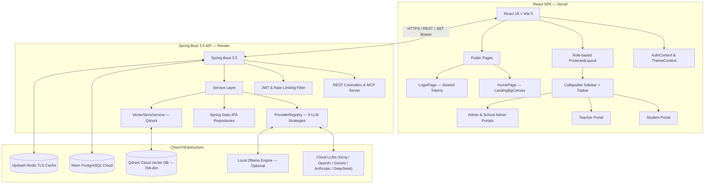
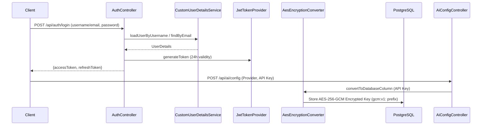
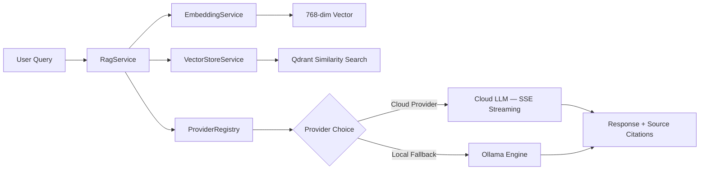
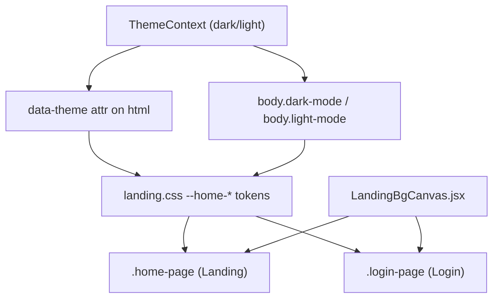

# 🏗️ Architecture Documentation

## System Architecture



---

## Frontend Package Structure

```text
frontend/src/
├── App.jsx                    # Main router — 105+ lazy-loaded role-guarded routes
├── main.jsx                   # React entry point, ThemeProvider, AuthProvider
├── api/                       # Axios clients (authApi, dashboardApi, aiConfigApi)
├── components/
│   ├── landing/               # Landing sections (Hero, FeatureGrid, Pricing, etc.) + LandingBgCanvas
│   ├── Sidebar.jsx            # Role-aware collapsible sidebar
│   ├── Topbar.jsx             # Persistent sidebar toggle, search, theme switch
│   └── FloatingAIAssistant.jsx# Global floating AI assistant widget
├── context/
│   ├── AuthContext.jsx        # JWT lifecycle, user state, offline fallback
│   └── ThemeContext.jsx       # Theme state (dark/light) via data-theme and body classes
├── layouts/
│   └── ProtectedLayout.jsx    # Shell layout: Sidebar + Topbar + Ctrl+B listener
├── pages/                     # Public (HomePage, LoginPage) & Portals (Admin, Teacher, Student, School)
└── styles/                    # Modular CSS design system (tokens, layout, pages, themes)
```

---

## Backend Package Structure

```text
backend/src/main/java/com/ai/dashboard/
├── AiStudentDashboardApplication.java   # Application entry point
├── ai/                                  # AI & RAG Subsystem
│   ├── controller/                      # ChatController, AiConfigController
│   ├── prompt/                          # Tutor, Homework, Quiz, LessonPlanner, DocumentQA templates
│   ├── provider/                        # Strategy layer: LlmProviderStrategy & ProviderRegistry (9 providers)
│   ├── rag/                             # RagService orchestration
│   ├── embedding/                       # EmbeddingServiceImpl (nomic-embed-text 768-dim)
│   └── vector/                          # QdrantProvider & VectorStoreProperties
├── config/                              # SecurityConfig, RedisConfig, RateLimitingFilter, HealthIndicators
├── controller/                          # REST Controllers (Auth, School, Student, Course, Dashboard)
├── document/                            # Document upload, chunking (PDFBox/POI), and storage
├── entity/                              # JPA Entities (User, UserAiConfig, Course, Enrollment, etc.)
├── mcp/                                 # Model Context Protocol (MCP) Server
│   ├── protocol/                        # JSON-RPC 2.0 models & McpToolDefinition schemas
│   ├── server/                          # McpServerController (/mcp/sse, /mcp/message)
│   ├── tools/                           # McpTool contract, McpToolRegistry & 4 built-in tools
│   └── agent/                           # McpAgentService — autonomous intent routing & 3-hop loop guard
├── repository/                          # Spring Data JPA repositories
├── security/                            # JwtAuthenticationFilter & CustomUserDetailsService
├── service/                             # Business domain services
├── validator/                           # SqlValidator — JSqlParser AST whitelist for Ask-AI
└── util/                                # AesEncryptionConverter (AES-256-GCM API key encryption)
```

---

## MCP Server Endpoints

| Method | Path | Auth | Description |
| :--- | :--- | :--- | :--- |
| `GET` | `/mcp/sse` | Optional | Establish persistent MCP SSE session (30-min timeout). Emits `endpoint` URI. |
| `POST` | `/mcp/message?sessionId={id}` | JWT | JSON-RPC 2.0 message handler (`initialize`, `tools/list`, `tools/call`, `ping`). |

---

## Security & Encryption Flow



---

## Dynamic AI Request Flow



---

## UI Theme Architecture



---

## Core System Strategies

- **Sidebar Access**: 3 independent mechanisms — Topbar toggle button (always visible), floating left-edge trigger (`›`), and `Ctrl+B` shortcut.
- **Data Protection**: User LLM API keys encrypted at rest using AES-256-GCM with unique 12-byte IV per record.
- **Cache & Throttling**: Upstash Redis manages 30-minute analytics caching and sliding-window rate limiting.