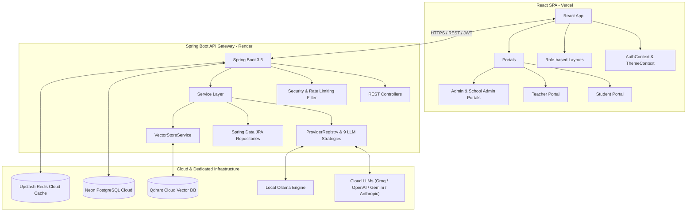
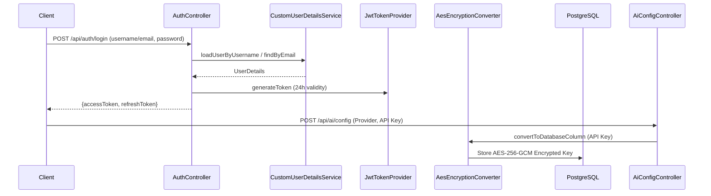
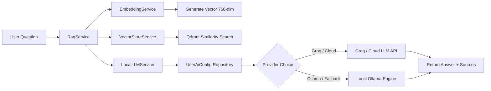

# 🏗️ Architecture Documentation

## System Architecture



---

## Backend Package Structure

```text
backend/src/main/java/com/ai/dashboard/
├── AiStudentDashboardApplication.java  # Main entry point
├── ai/                                # AI & RAG components
│   ├── controller/                    # ChatController, AiConfigController
│   ├── model/                         # OllamaProvider model wrapper
│   ├── prompt/                        # Prompt templates (Tutor, Homework, Quiz, LessonPlanner, DocumentQA)
│   ├── provider/                      # Multi-provider LLM strategy layer
│   │   ├── LlmProviderStrategy.java   # Strategy interface
│   │   ├── ProviderRegistry.java      # Registry mapping 9 providers
│   │   └── impl/                      # Groq, OpenAI, Gemini, Anthropic, OpenRouter, Azure, DeepSeek, Mistral, Ollama
│   ├── rag/                           # RAG pipeline & RagServiceImpl
│   ├── embedding/                     # EmbeddingServiceImpl (nomic-embed-text)
│   └── vector/                        # QdrantProvider & VectorStoreProperties
├── config/                            # Spring configurations
│   ├── health/                        # OllamaHealthIndicator, RedisHealthIndicator, QdrantHealthIndicator
│   ├── SecurityConfig.java
│   ├── RedisConfig.java
│   └── RateLimitingFilter.java        # Upstash Redis rate limiting
├── controller/                        # REST controllers (Auth, School, Student, Course, Dashboard)
├── document/                          # Document management & file storage
├── entity/                            # JPA entities (User, UserAiConfig, Course, Enrollment, etc.)
├── repository/                        # Spring Data JPA repositories
├── security/                          # JwtAuthenticationFilter & CustomUserDetailsService
├── service/                           # Business logic services
└── util/                              # AesEncryptionConverter (AES-256-GCM API key encryption)
```

---

## Security & Encryption Flow



---

## Dynamic AI Request Flow



---

## Caching & Rate Limiting Strategy

- **Upstash Redis**: Stores 30-minute analytics caches (`entryTtl: 30 minutes`).
- **Rate Limiting**: `RateLimitingFilter` tracks IP/user request buckets in Redis.
- **TLS Encryption**: `SPRING_REDIS_SSL=true` for secure cloud connectivity.