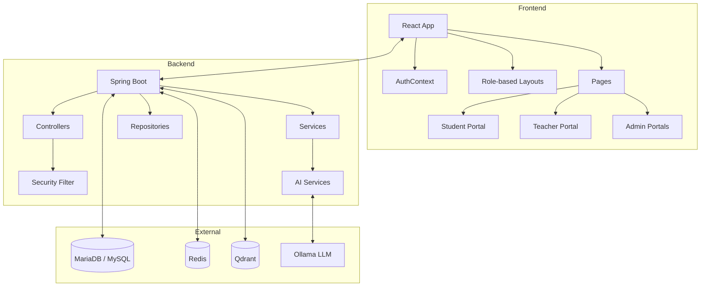
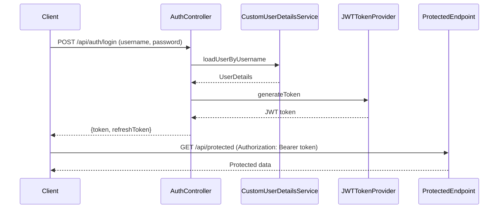
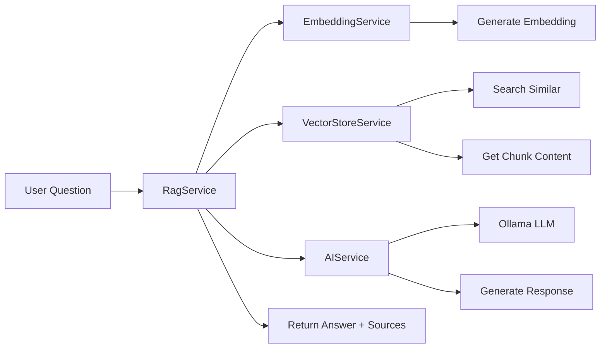
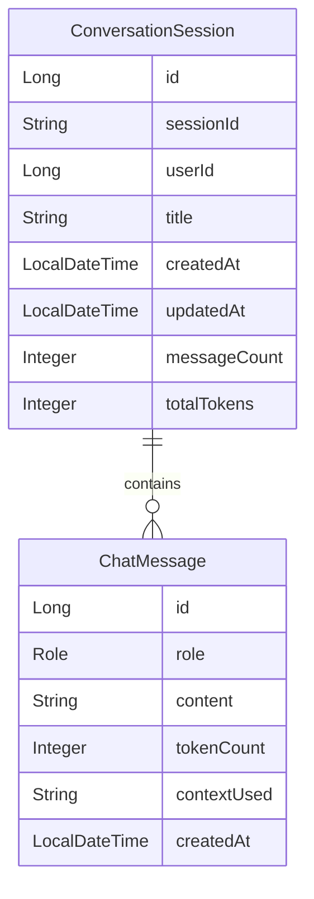

# Architecture Documentation

## System Architecture



## Frontend Architecture

### Component Structure
```
frontend/src/
├── pages/
│   ├── student/       # Student dashboard, courses, assignments, grades
│   ├── teacher/       # Teacher dashboard, course management, grading
│   ├── admin/         # Admin portals and management
│   └── exam/          # Examination module
├── components/        # Reusable UI components
│   └── Sidebar.jsx    # Navigation sidebar
└── context/           # React contexts
    └── AuthContext.js # Authentication context
```

### State Management
- React Context API for authentication
- Local component state for page-specific data
- No global state management (Redux/Zustand)

## Backend Architecture

### Package Structure
```
backend/src/main/java/com/ai/dashboard/
├── AiStudentDashboardApplication.java  # Main entry point
├── ai/                                # AI/RAG components
│   ├── prompt/                        # Prompt templates
│   │   ├── TutorPromptTemplate.java
│   │   ├── HomeworkPromptTemplate.java
│   │   ├── QuizPromptTemplate.java
│   │   ├── LessonPlannerPromptTemplate.java
│   │   └── DocumentQAPromptTemplate.java
│   ├── rag/                           # RAG pipeline
│   ├── embedding/                     # Embedding services
│   └── vector/                        # Vector store
├── config/                            # Configuration classes
│   ├── WebSocketConfig.java
│   ├── RedisConfig.java
│   ├── MetricsConfig.java
│   ├── OllamaProperties.java
│   └── LoggingFilter.java             # Request logging
├── controller/                        # REST controllers
├── document/                          # Document management
├── entity/                            # JPA entities
├── repository/                        # Spring Data repositories
├── security/                          # JWT security
└── service/                           # Business services
```

## Security Flow



## Authentication Flow

1. User provides credentials to `/api/auth/login`
2. `CustomUserDetailsService` validates credentials
3. `JWTTokenProvider` generates access and refresh tokens
4. Tokens are returned to client
5. Client includes `Authorization: Bearer <token>` header
6. `JWTAuthenticationFilter` validates token on each request

## AI Request Flow



## RAG Pipeline

1. **Question Embedding**: User question is converted to vector via Ollama embeddings
2. **Vector Search**: Similar document chunks are retrieved from Qdrant
3. **Context Retrieval**: Full chunk content is retrieved from database
4. **Prompt Building**: Context + question is formatted using prompt templates
5. **LLM Generation**: Ollama generates response based on context
6. **Response**: Answer with source citations is returned

## Conversation Memory



## Caching Strategy

- **Redis**: Used for session storage and caching
- **Spring Cache**: @Cacheable, @CacheEvict annotations on services
- **Cache Regions**: `courses`, `assignments` (configurable)

## Database Design

### Key Entities
- `User` - Authentication and profile
- `Course` - Course offerings
- `Enrollment` - Student-course relationships
- `Assignment` - Course assignments
- `Submission` - Student submissions
- `Document` - File storage
- `DocumentChunk` - Text chunks for RAG
- `ConversationSession` - Chat sessions (new)
- `ChatMessage` - Individual messages (new)

---

See `Database.md` for detailed entity relationships.