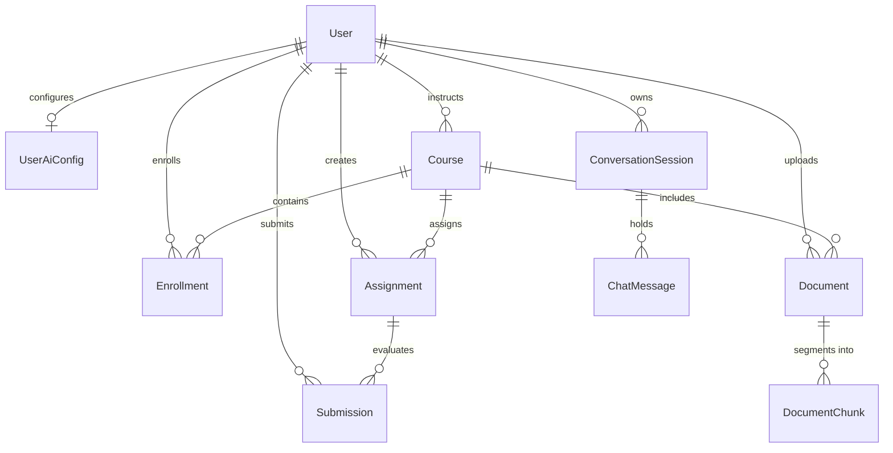

# 🗄️ Database Documentation

PostgreSQL schema models, entity relationships, indexes, and demographic data partitions.

---

## 1. Student Populations Architecture

The schema maintains two intentionally isolated student models:

| Dimension | `users` (Role `ROLE_STUDENT`) | `student` Table |
| :--- | :--- | :--- |
| **Purpose** | Operational user accounts for authentication and coursework | Standalone demo dataset for Natural-Language SQL (Ask-AI) |
| **Created Via** | User registration / Admin user management | Database seed script |
| **Foreign Keys** | Linked to `enrollments`, `submissions`, `documents` | **None** (isolated standalone table) |
| **Read By** | Application authentication and academic workflows | `AiQueryServiceImpl` and `StudentAnalyticsMcpTool` only |

> [!NOTE]
> - Counts differ intentionally: Dashboard metrics count registered users in `users`, while Ask-AI counts records in `student`.
> - `SqlValidator` allows querying only the `student` table, completely preventing access to user passwords or operational records.

---

## 2. Core Entities

| Entity | Table Name | Key Fields | Indexes / Constraints |
| :--- | :--- | :--- | :--- |
| **User** | `users` | `id`, `username`, `email`, `password`, `roles`, `enabled`, `school_id` | Indexes: `email`, `username`, `enabled` |
| **UserAiConfig** | `user_ai_configs` | `id`, `user_id`, `provider`, `api_key` *(encrypted)*, `model`, `temperature` | Index: `user_id` (AES-256-GCM encrypted key) |
| **Course** | `courses` | `id`, `course_code`, `title`, `description`, `teacher_id`, `school_id`, `status` | Indexes: `teacher_id`, `status`, `school_id` |
| **Enrollment** | `enrollments` | `id`, `student_id`, `course_id`, `enrollment_date`, `status`, `progress` | Unique: `(student_id, course_id)`; Index: `status` |
| **Assignment** | `assignments` | `id`, `title`, `instructions`, `due_date`, `max_marks`, `status`, `course_id` | Indexes: `course_id`, `teacher_id`, `due_date` |
| **Submission** | `submissions` | `id`, `assignment_id`, `student_id`, `status`, `obtained_marks`, `feedback` | Unique: `(student_id, assignment_id)` |
| **Document** | `documents` | `id`, `filename`, `content_type`, `file_size`, `course_id`, `processing_status` | Indexes: `course_id`, `processing_status` |
| **DocumentChunk** | `document_chunks` | `id`, `document_id`, `chunk_index`, `content`, `token_count` | Index: `document_id` |
| **ChatSession** | `conversation_sessions` | `id`, `session_id`, `user_id`, `title`, `total_tokens` | Indexes: `user_id`, `session_id` |
| **ChatMessage** | `chat_messages` | `id`, `session_id`, `role`, `content`, `token_count` | Indexes: `session_id`, `created_at` |
| **Student (Demo)**| `student` | `id`, `name`, `course`, `subject`, `fee`, `address`, `joining_date` | Isolated table for SQL analytics queries |

---

## 3. Entity Relationships

*Note: The `student` demo table is completely detached from the operational ER graph.*

---

## 4. Key Indexes

| Table | Indexed Columns | Query Target |
| :--- | :--- | :--- |
| `users` | `email`, `username` | Authentication lookups |
| `user_ai_configs` | `user_id` | AI configuration retrieval |
| `courses` | `teacher_id`, `status` | Course catalog filtering |
| `assignments` | `course_id`, `due_date` | Course workload listings |
| `submissions` | `student_id`, `assignment_id` | Gradebook retrieval |
| `documents` | `course_id`, `processing_status`| RAG indexing queue |
| `conversation_sessions`| `user_id`, `session_id` | Chat history lookups |