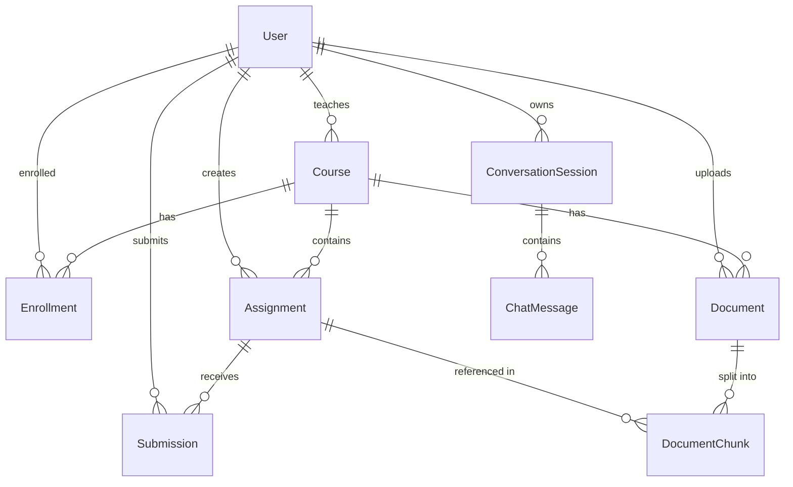

# Database Documentation

## Entity Descriptions

### User
- Represents users with role-based access
- Fields: id, username, email, password, roles, enabled flags, version
- Indexed: enabled, email

### Course
- Course offerings with teacher assignment
- Fields: id, courseCode, title, description, teacher, status
- Indexed: teacher_id, status

### Enrollment
- Student enrollment in courses
- Fields: id, student, course, enrollmentDate, status, progress
- Unique constraint: (student_id, course_id)
- Indexed: status, student_id, course_id

### Assignment
- Course assignments/exams
- Fields: id, title, description, instructions, dueDate, maxMarks, status, teacher, course
- Indexed: course_id, teacher_id, status, due_date

### Submission
- Student assignment submissions
- Fields: id, assignment, student, status, submissionText, attachmentUrl, obtainedMarks, feedback
- Unique constraint: (student_id, assignment_id)
- Indexed: student_id, assignment_id, status, submitted_at

### Document
- File storage for RAG processing
- Fields: id, filename, originalFilename, contentType, fileSize, uploadedBy, uploadTime, documentType, course, storagePath, processingStatus
- Indexed: uploaded_by, course_id, document_type, processing_status

### DocumentChunk
- Text chunks for vector search
- Fields: id, documentId, chunkIndex, content, tokenCount, embeddingGenerated, createdAt
- Indexed: document_id, embedding_generated

### ConversationSession (New)
- Chat conversation sessions
- Fields: id, sessionId, userId, title, messageCount, totalTokens, createdAt, updatedAt
- Indexed: user_id, session_id

### ChatMessage (New)
- Individual chat messages
- Fields: id, session, role, content, tokenCount, contextUsed, createdAt
- Indexed: session_id, created_at, role

## Entity Relationships

## Indexes Added

| Table | Column | Purpose |
|-------|--------|---------|
| assignments | course_id | Query assignments by course |
| assignments | teacher_id | Query assignments by teacher |
| assignments | status | Filter by assignment status |
| assignments | due_date | Sort by due date |
| courses | teacher_id | Query courses by teacher |
| courses | status | Filter active courses |
| users | enabled | Query active users |
| users | email | Email lookups |
| submissions | student_id | Query submissions by student |
| submissions | assignment_id | Query by assignment |
| submissions | status | Filter by status |
| submissions | submitted_at | Sort by date |
| enrollments | student_id | Query enrollments |
| enrollments | course_id | Query by course |
| enrollments | status | Filter by status |
| documents | uploaded_by | Query by uploader |
| documents | course_id | Filter by course |
| documents | document_type | Filter by type |
| documents | processing_status | Track processing |
| document_chunks | document_id | Query by document |
| document_chunks | embedding_generated | Track embedding status |
| conversation_sessions | user_id | Query by user |
| conversation_sessions | session_id | Session lookup |
| chat_messages | session_id | Query by session |