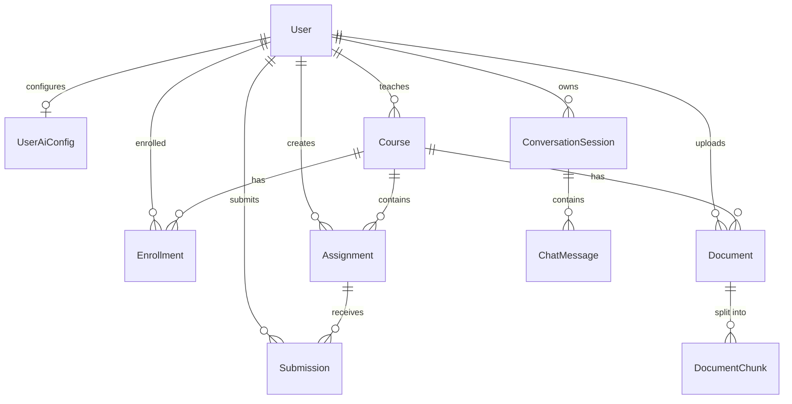

# 🗄️ Database Documentation

## ⚠️ Two separate student populations

This schema contains **two unrelated representations of a student**, and they are intentionally kept
apart:

| | `users` (with `ROLE_STUDENT`) | `student` |
| :--- | :--- | :--- |
| Purpose | Real accounts that log in and use the platform | Standalone demo dataset for the natural-language analytics feature |
| Created by | Registration / admin user management | Seed data |
| Foreign keys | Referenced by `enrollments`, `submissions`, `documents`, `courses.teacher_id` | **None** — nothing references it and it references nothing |
| Read by | The whole application | `AiQueryServiceImpl` (Ask-AI) only |

Consequences worth knowing before you touch either:

- **Counts will not agree.** "Total students" on the dashboard counts `users` with `ROLE_STUDENT`.
  "How many students" asked through Ask-AI counts rows in `student`. Both are correct for their own
  population. This is expected, not a bug.
- **Registering a user does not create a `student` row**, and seeding `student` rows does not create
  logins. There is no synchronisation between the two.
- **The AI cannot see real users.** `SqlValidator.ALLOWED_TABLES` whitelists `student` and nothing
  else, so a generated (or prompt-injected) query cannot reach `users` or any operational table.

If the demo dataset is ever retired, the migration path is to point the NL-to-SQL prompt and
`SqlValidator` at a purpose-built read-only reporting view over the real tables — not to add foreign
keys to `student`.

## Entity Descriptions

### Student (`student`)
- Flat demo dataset backing the Ask-AI natural-language-to-SQL feature. **Not** the user roster; see
  the note above.
- Fields: `id`, `name`, `course`, `subject`, `fee`, `address`, `joining_date`, `created_at`.
- No relationships to any other entity.

### User (`users`)
- Represents system users across all roles (`ROLE_ADMIN`, `ROLE_SCHOOL_ADMIN`, `ROLE_PRINCIPAL`, `ROLE_TEACHER`, `ROLE_STUDENT`).
- Fields: `id`, `username`, `email`, `password`, `roles`, `enabled`, `school_id`, `created_at`, `updated_at`.
- Indexed: `enabled`, `email`, `username`.

### UserAiConfig (`user_ai_configs`)
- Stores per-user AI provider preferences and API credentials.
- Fields: `id`, `user_id`, `provider` (Groq, OpenAI, Gemini, etc.), `api_key` *(AES-256-GCM encrypted via `AesEncryptionConverter`)*, `base_url`, `model`, `temperature`, `max_tokens`, `streaming_enabled`, `ai_suggestions_enabled`, `is_connected`, `last_verified_at`.
- Indexed: `user_id`.

### Course (`courses`)
- Academic course offerings with teacher assignments.
- Fields: `id`, `courseCode`, `title`, `description`, `teacher_id`, `school_id`, `status`.
- Indexed: `teacher_id`, `status`, `school_id`.

### Enrollment (`enrollments`)
- Student enrollment in courses.
- Fields: `id`, `student_id`, `course_id`, `enrollmentDate`, `status`, `progress`.
- Unique Constraint: `(student_id, course_id)`.
- Indexed: `status`, `student_id`, `course_id`.

### Assignment (`assignments`)
- Course homework, tasks, and examinations.
- Fields: `id`, `title`, `description`, `instructions`, `dueDate`, `maxMarks`, `status`, `teacher_id`, `course_id`.
- Indexed: `course_id`, `teacher_id`, `status`, `due_date`.

### Submission (`submissions`)
- Student assignment submissions and AI/Teacher evaluations.
- Fields: `id`, `assignment_id`, `student_id`, `status`, `submissionText`, `attachmentUrl`, `obtainedMarks`, `feedback`.
- Unique Constraint: `(student_id, assignment_id)`.
- Indexed: `student_id`, `assignment_id`, `status`, `submitted_at`.

### Document (`documents`)
- Academic file storage for RAG vector processing.
- Fields: `id`, `filename`, `originalFilename`, `contentType`, `fileSize`, `uploadedBy`, `uploadTime`, `documentType`, `course_id`, `storagePath`, `processingStatus`.
- Indexed: `uploaded_by`, `course_id`, `document_type`, `processing_status`.

### DocumentChunk (`document_chunks`)
- Text chunks for vector search.
- Fields: `id`, `documentId`, `chunkIndex`, `content`, `tokenCount`, `embeddingGenerated`, `createdAt`.
- Indexed: `document_id`, `embedding_generated`.

### ConversationSession (`conversation_sessions`)
- Chat conversation sessions.
- Fields: `id`, `sessionId`, `userId`, `title`, `messageCount`, `totalTokens`, `createdAt`, `updatedAt`.
- Indexed: `user_id`, `session_id`.

### ChatMessage (`chat_messages`)
- Individual AI and user chat messages.
- Fields: `id`, `session_id`, `role`, `content`, `tokenCount`, `contextUsed`, `createdAt`.
- Indexed: `session_id`, `created_at`, `role`.

---

## Entity Relationships

`student` is deliberately absent from the diagram above: it has no relationships. It is an island.

---

## Database Indexes Summary

| Table | Column | Purpose |
| :--- | :--- | :--- |
| `users` | `email`, `username`, `enabled` | User authentication & email lookups |
| `user_ai_configs` | `user_id` | Quick retrieval of user AI settings |
| `assignments` | `course_id`, `teacher_id`, `status`, `due_date` | Assignment filtering and sorting |
| `courses` | `teacher_id`, `status`, `school_id` | Course management queries |
| `submissions` | `student_id`, `assignment_id`, `status` | Submission grade tracking |
| `enrollments` | `student_id`, `course_id`, `status` | Student enrollment validation |
| `documents` | `uploaded_by`, `course_id`, `processing_status` | RAG document pipeline tracking |
| `conversation_sessions`| `user_id`, `session_id` | AI chat session lookups |