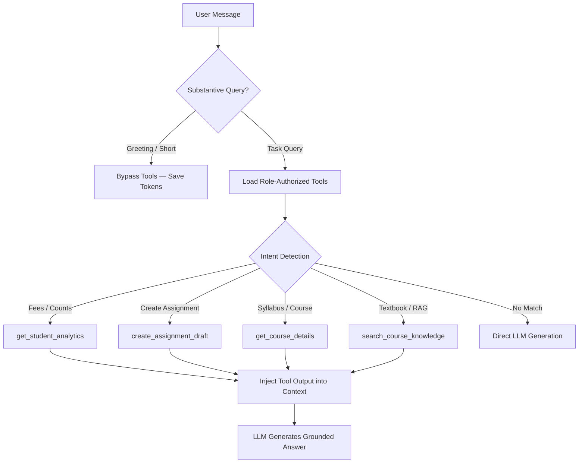

# 🤖 Model Context Protocol (MCP) Documentation

The platform provides a native **Model Context Protocol (MCP)** Server (Protocol Version: `2024-11-05`), enabling external AI agents (Claude Desktop, Cursor IDE, LangChain agents) to query school data and trigger actions via standardized JSON-RPC 2.0.

---

## 1. Architecture & Package Structure

Located in `com.ai.dashboard.mcp`:

```text
backend/src/main/java/com/ai/dashboard/mcp/
├── protocol/
│   ├── McpMessage.java          # JSON-RPC 2.0 request/response/error models
│   └── McpToolDefinition.java   # Tool schema descriptor (JSON Schema format)
├── server/
│   └── McpServerController.java # Endpoints: /mcp/sse and /mcp/message
├── tools/
│   ├── McpTool.java             # Contract: name, description, schema, isAuthorized, execute
│   ├── McpToolRegistry.java     # Auto-discovers and role-filters McpTool beans
│   └── impl/                    # 4 Built-in tools (analytics, assignments, courses, RAG)
└── agent/
    └── McpAgentService.java     # Autonomous tool dispatching with 3-hop loop guard
```

---

## 2. Server Endpoints

| Method | Path | Auth | Description |
| :--- | :--- | :--- | :--- |
| `GET` | `/mcp/sse` | Optional | Opens persistent SSE connection (30-min timeout). Emits `endpoint` event with session ID. |
| `POST` | `/mcp/message?sessionId={id}` | JWT | Dispatches JSON-RPC 2.0 commands to the active session. |

### SSE Handshake Flow
```text
Client -> GET /mcp/sse
Server -> event: endpoint
          data: /api/mcp/message?sessionId=8f7e2d14-...

Client -> POST /mcp/message?sessionId=8f7e2d14-...
          { "jsonrpc": "2.0", "method": "initialize", "id": 1 }
Server -> { "jsonrpc": "2.0", "result": { "protocolVersion": "2024-11-05", ... }, "id": 1 }
```

---

## 3. JSON-RPC 2.0 Protocol Methods

| Method | Purpose | Key Parameters | Return Value |
| :--- | :--- | :--- | :--- |
| `initialize` | Client handshake & capability exchange | `clientInfo` | Protocol version (`2024-11-05`) & server capabilities |
| `tools/list` | Discovers available tools | *(none)* | Array of tools with JSON Schema definitions (role-filtered) |
| `tools/call` | Executes a specific tool | `name`, `arguments` | MCP `CallToolResult` text payload and `isError` flag |
| `ping` | Connection keepalive probe | *(none)* | Empty result object |

### Sample Tool Invocation (`tools/call`)
```json
// Request:
{
  "jsonrpc": "2.0",
  "method": "tools/call",
  "id": 10,
  "params": {
    "name": "get_student_analytics",
    "arguments": { "metricType": "fee_summary" }
  }
}

// Response:
{
  "jsonrpc": "2.0",
  "id": 10,
  "result": {
    "content": [{ "type": "text", "text": "{\"averageFeeINR\": 12500.0, \"totalStudents\": 50}" }],
    "isError": false
  }
}
```

---

## 4. Built-in Educational Tools

### 1. `get_course_details`
- **Scope**: Lookup course syllabus, assigned instructor, and enrollment status by code.
- **Access**: All authenticated users.
- **Input**: `courseCode: string` (e.g. `"CS101"`).

### 2. `get_student_analytics`
- **Scope**: Institutional fee statistics and demographic breakdowns from the demo `student` table.
- **Access**: `ROLE_TEACHER`, `ROLE_ADMIN`, `ROLE_SCHOOL_ADMIN`, `ROLE_PRINCIPAL`.
- **Input**: `metricType` (`"fee_summary"` | `"course_counts"` | `"total_students"` | `"city_distribution"`), optional `course: string`.

### 3. `create_assignment_draft`
- **Scope**: Generates a course assignment draft for instructor review before publishing.
- **Access**: `ROLE_TEACHER`, `ROLE_ADMIN`, `ROLE_SCHOOL_ADMIN`.
- **Input**: `title: string` (required), `courseCode: string` (required), `description`, `instructions`, `maxMarks: integer`.

### 4. `search_course_knowledge`
- **Scope**: Semantic vector retrieval across uploaded course documents in Qdrant Cloud.
- **Access**: All authenticated users.
- **Input**: `query: string` (required), optional `courseId: integer`.

---

## 5. Role-Based Tool Authorization Matrix

| Tool | STUDENT | TEACHER | SCHOOL ADMIN | PRINCIPAL | ADMIN / SUPER ADMIN |
| :--- | :---: | :---: | :---: | :---: | :---: |
| `get_course_details` | ✅ | ✅ | ✅ | ✅ | ✅ |
| `search_course_knowledge` | ✅ | ✅ | ✅ | ✅ | ✅ |
| `get_student_analytics` | ❌ | ✅ | ✅ | ✅ | ✅ |
| `create_assignment_draft` | ❌ | ✅ | ✅ | ❌ | ✅ |

*Unauthorized tool requests return a graceful `isError: true` message without leaking operational data.*

---

## 6. Agentic Orchestrator (`McpAgentService`)

`McpAgentService` provides autonomous tool selection within the platform's chat:



- **Token Economy**: Casual greetings skip tool definitions, saving ~300 tokens per prompt.
- **Loop Guard**: Maximum of 3 tool hops per turn (`MAX_TOOL_HOPS = 3`) prevents infinite recursion.

---

## 7. Connecting Claude Desktop

Add to `%APPDATA%\Claude\claude_desktop_config.json` (Windows) or `~/Library/Application Support/Claude/claude_desktop_config.json` (macOS):

```json
{
  "mcpServers": {
    "ai-school-platform": {
      "url": "https://ai-school-management-system-l0a0.onrender.com/mcp/sse",
      "transport": "sse"
    }
  }
}
```

---

## 8. Adding a New MCP Tool

1. Create a class implementing `McpTool` under `com.ai.dashboard.mcp.tools.impl`:

```java
@Component
@RequiredArgsConstructor
public class CustomMcpTool implements McpTool {

    @Override public String getName() { return "custom_tool"; }
    @Override public String getDescription() { return "Describe what this tool does."; }

    @Override
    public Map<String, Object> getInputSchema() {
        return Map.of(
            "type", "object",
            "properties", Map.of("query", Map.of("type", "string")),
            "required", List.of("query")
        );
    }

    @Override
    public boolean isAuthorized(Authentication auth) {
        return auth != null && auth.isAuthenticated();
    }

    @Override
    public Map<String, Object> execute(Map<String, Object> args, Authentication auth) {
        return Map.of("result", "data");
    }
}
```

2. `McpToolRegistry` automatically discovers the `@Component` bean at startup.
