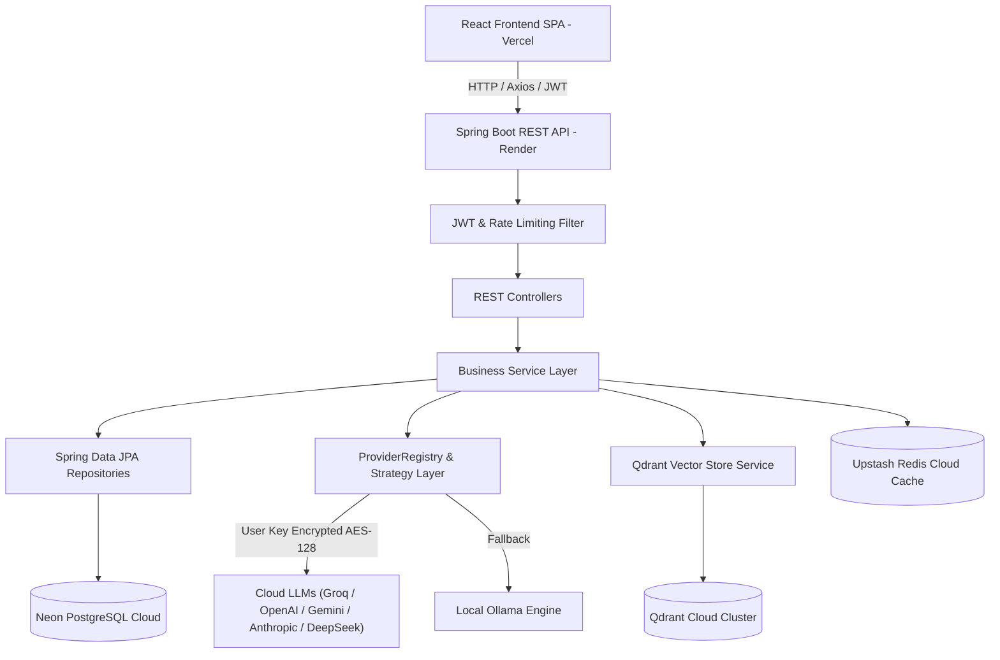
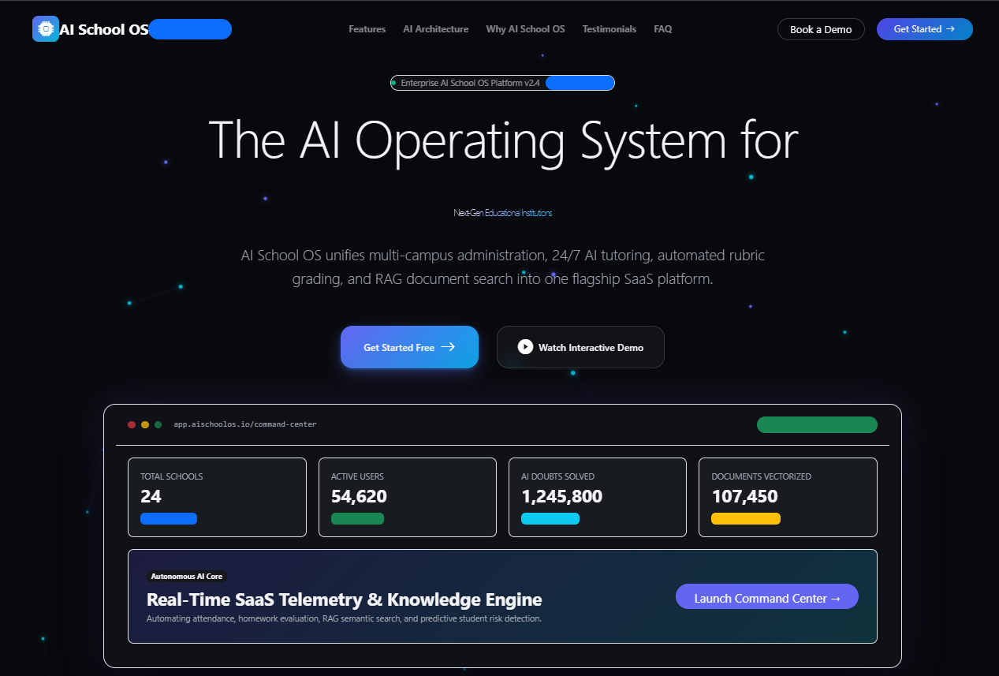
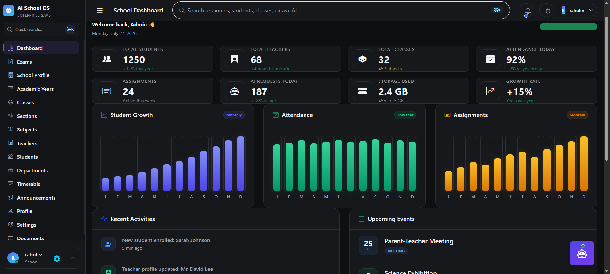
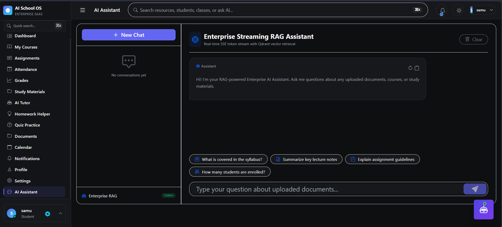

# 🎓 AI School Management & Analytics Platform

[](https://spring.io/projects/spring-boot)
[](https://react.dev/)
[](https://www.oracle.com/java/)
[](https://opensource.org/licenses/MIT)

> *An enterprise-grade, AI-powered School Management & Retrieval-Augmented Generation (RAG) System featuring 9 multi-provider LLMs, cloud vector search, role-based access control, and comprehensive academic analytics.*

---

## 🌐 Live Production Application

- **Frontend Application**: [https://aischoolsystem.vercel.app](https://aischoolsystem.vercel.app) *(Hosted on Vercel)*
- **Backend API Gateway**: [https://ai-school-management-system-l0a0.onrender.com](https://ai-school-management-system-l0a0.onrender.com) *(Hosted on Render)*
- **Cloud Database**: Neon Serverless PostgreSQL
- **Cloud Cache & Rate Limiting**: Upstash Redis (TLS)
- **Cloud Vector Store**: Qdrant Cloud Cluster

---

## 1. Project Overview

### What Problem This Solves
Managing educational institutions requires handling complex administrative workflows—student records, teacher allocations, course enrollments, gradebooks, and document management—while modern educators increasingly demand AI assistance for lesson planning, quizzing, and document search. Traditional school management systems lack native artificial intelligence capabilities, requiring disjointed third-party plugins.

### Why It Was Built
This platform was built to demonstrate how enterprise-grade Java architectures (`Spring Boot`) and modern frontend SPAs (`React`) can be seamlessly integrated with cutting-edge AI pipelines (`Spring AI`, `LangChain4j`, `Qdrant Cloud`, `Upstash Redis`, and Multi-Provider Cloud LLMs) to provide a unified, secure, and intelligent school administration ecosystem.

### 💡 Important Note: Cloud AI Providers vs Local Ollama
> [!IMPORTANT]
> **No Local LLM or Ollama Needed!**
> If you do not have **Ollama** installed on your local computer, or when running in 24/7 Cloud Production (e.g. Render):
> 1. Simply log in and open **AI Settings** (`/settings`).
> 2. Select a Cloud AI Provider such as **Groq** *(Free & Ultra-Fast)*, **OpenAI**, **Google Gemini**, **Anthropic**, **OpenRouter**, **Azure OpenAI**, **DeepSeek**, or **Mistral AI**.
> 3. Enter your API key, click **Verify Connection**, and click **Save Settings**.
> Your API key will be encrypted using **AES-128** in the database, and the assistant will immediately respond using your chosen cloud provider!

### Who Can Use It
- **Super Admins / Platform Owners**: Manage multi-tenant schools, system users, subscriptions, and platform-wide analytics.
- **School Admins**: Oversee individual school operations, classes, sections, subjects, teachers, and students.
- **Principals**: Monitor institutional performance analytics, attendance trends, financial reports, and system health.
- **Teachers**: Manage classrooms, mark attendance registers, grade assignments, generate AI quizzes and lesson plans, and upload study materials.
- **Students**: Track course progress, submit assignments, interact with AI tutors, practice quizzes, and view academic grades.

---

## 2. Project Features

### 🔐 Authentication & Security
- **Stateless JWT Authentication** with refresh token support and 24-hour expiration (`86,400,000 ms`).
- **Role-Based Access Control (RBAC)** supporting `ROLE_ADMIN`, `ROLE_SCHOOL_ADMIN`, `ROLE_PRINCIPAL`, `ROLE_TEACHER`, and `ROLE_STUDENT`.
- **AES-128 Database Field Encryption** (`AesEncryptionConverter`) securing sensitive user API keys in PostgreSQL.
- **Rate Limiting Protection** (`RateLimitingFilter`) backed by Upstash Redis to prevent brute-force attacks and API abuse.

### 🤖 Multi-Provider AI & RAG Pipeline
- **9 Supported LLM Providers**: `Ollama`, `Groq`, `OpenAI`, `Google Gemini`, `Anthropic`, `OpenRouter`, `Azure OpenAI`, `DeepSeek`, and `Mistral AI`.
- **Per-User AI Configuration**: Custom provider, API key, model selection, base URL, temperature, and max tokens.
- **Retrieval-Augmented Generation (RAG)**: Instant semantic vector search across course documents powered by Qdrant Cloud.
- **AI Educational Tools**: AI Lesson Planner, AI Quiz Generator, and 24/7 EduAI Knowledge Assistant.

### 🏫 School & Academic Management
- **Multi-Tenant Administration**: School onboarding with automated School Admin account provisioning.
- **Student & Teacher Portals**: Course offerings, teacher assignments, student enrollments, and academic calendars.
- **Gradebook & Register**: Digital attendance registers, automated grade converters, and PDF/CSV exporter tools.

---

## 3. System Architecture



---

## 4. Project Structure

```text
AI-School-Management-System/
├── backend/
│   ├── src/main/java/com/ai/dashboard/
│   │   ├── ai/               # Multi-provider strategies (Groq, OpenAI, Gemini, etc.), prompts, vector search
│   │   ├── config/           # Spring Security, Redis, WebSocket, Actuator Health Indicators
│   │   ├── controller/       # REST API endpoints (Auth, AI Config, Schools, Students, Courses)
│   │   ├── document/         # RAG Document upload, text extraction & chunking
│   │   ├── dto/              # Data Transfer Objects & Response wrappers
│   │   ├── entity/           # JPA entities (User, UserAiConfig, Course, Enrollment, Document, etc.)
│   │   ├── repository/       # Spring Data JPA repositories
│   │   ├── security/         # JWT filter, token provider & user details service
│   │   ├── service/          # Business logic interfaces and implementations
│   │   └── util/             # AES encryption converters and helper utilities
│   └── src/main/resources/   # application.yml, application-dev.yml, application-prod.yml
│
└── frontend/
    ├── src/
    │   ├── api/              # API clients for Auth, Dashboard, AI Config, Courses
    │   ├── components/       # UI components (AiSettings, SystemStatus, Charts, Modals)
    │   ├── context/          # React Context (AuthContext, ThemeContext)
    │   ├── pages/            # View pages (HomePage, LoginPage, AdminDashboard, Settings)
    │   └── styles/           # CSS design system and responsive utilities
```

---

## 5. Technology Stack

| Category | Technology | Version | Description |
| :--- | :--- | :--- | :--- |
| **Frontend** | React | 18.x | Single Page Application framework |
| | React Router | 6.x | Client-side routing and protected portals |
| | Bootstrap / Vanilla CSS | 5.x | Responsive design system & micro-animations |
| | Chart.js | 4.x | Real-time analytics & telemetry charts |
| **Backend** | Java | 21 | Enterprise programming language |
| | Spring Boot | 3.5.x | Application framework |
| | Spring Data JPA | 3.x | ORM & PostgreSQL database mappings |
| | Spring Security | 6.x | JWT authentication & RBAC method security |
| | Jackson | 2.x | JSON serialization & date handling |
| **Database & Cache**| PostgreSQL | 16+ | Primary relational database (Neon Cloud) |
| | Upstash Redis | Latest | Serverless TLS Redis for caching & rate limiting |
| **AI & Vector** | Qdrant Cloud | Latest | Vector database for 768-dim RAG embeddings |
| | Multi-LLM Strategies | Dynamic | Groq, OpenAI, Gemini, Anthropic, OpenRouter, Azure, DeepSeek, Mistral, Ollama |

---

## 6. Installation & Quick Start Guide

### Step 1: Clone the Repository
```bash
git clone https://github.com/Dheerajdvn/AI-School-Management-System.git
cd AI-School-Management-System
```

### Step 2: Spin Up Local Infrastructure (Docker)
Run local PostgreSQL, Redis, and Qdrant instances:
```bash
docker-compose up -d
```

### Step 3: Run the Spring Boot Backend
Navigate to the `backend` directory and start the application:
```bash
cd backend
mvn spring-boot:run
```
*(Optionally set database environment variables if connecting to a cloud database)*:
```powershell
$env:SPRING_DATASOURCE_URL="jdbc:postgresql://ep-flat-union-agoznlwx-pooler.c-2.eu-central-1.aws.neon.tech/neondb?sslmode=require"
$env:SPRING_DATASOURCE_USERNAME="neondb_owner"
$env:SPRING_DATASOURCE_PASSWORD="your-neon-password"
mvn spring-boot:run
```

### Step 4: Start the React Frontend
Open a new terminal window, navigate to `frontend`, install dependencies, and launch Vite:
```bash
cd frontend
npm install
npm run dev
```

### Step 5: Access & Configure AI
1. Open your browser to `http://localhost:5173`.
2. Log in with admin credentials:
   - **Username**: `dheerajdvn`
   - **Password**: `root@123`
3. Go to **AI Settings** (`/settings`).
4. Select **Groq** (or your preferred provider), paste your API key, click **Verify Connection**, and click **Save Settings**.

---

## 7. Environment Variables & Production Targets

| Variable | Description | Local Development Default | Production Target (Render / Vercel) |
| :--- | :--- | :--- | :--- |
| `SPRING_PROFILES_ACTIVE` | Active profile | `dev` | `prod` |
| `SPRING_DATASOURCE_URL` | PostgreSQL JDBC URI | `jdbc:postgresql://localhost:5432/schooldb` | Neon PostgreSQL SSL URI |
| `SPRING_DATASOURCE_USERNAME` | Database username | `postgres` | Neon Owner Username |
| `SPRING_DATASOURCE_PASSWORD` | Database password | `postgres` | Neon Owner Password |
| `SPRING_REDIS_HOST` | Redis host | `localhost` | Upstash Redis Host |
| `SPRING_REDIS_PORT` | Redis port | `6379` | `6379` |
| `SPRING_REDIS_PASSWORD` | Redis password | *(empty)* | Upstash Auth Token |
| `SPRING_REDIS_SSL` | Enable Redis TLS | `false` | `true` |
| `QDRANT_HOST` | Qdrant host | `localhost` | Qdrant Cloud Endpoint |
| `QDRANT_PORT` | Qdrant port | `6333` | `6333` / `443` |
| `QDRANT_API_KEY` | Qdrant Cloud key | *(empty)* | Qdrant Cloud API Key |
| `CORS_ALLOWED_ORIGINS` | Allowed CORS origins | `http://localhost:5173,http://localhost:3000` | `https://aischoolsystem.vercel.app` |
| `JWT_SECRET` | Signing secret key | Long local secret | Cryptographically random secret |
| `JWT_EXPIRATION` | Token expiry (ms) | `86400000` (24 Hours) | `86400000` (24 Hours) |
| `APP_ENCRYPTION_KEY` | AES-128 Field key | `1234567890123456` | 16-byte secret encryption key |
| `JAVA_OPTS` | JVM memory limits | *(default)* | `-Xmx320m -Xms256m -XX:+UseG1GC -XX:+ExitOnOutOfMemoryError` |

---

## 8. Key API Endpoints

- **Authentication**:
  - `POST /api/auth/login` — User login & JWT issuance
  - `POST /api/auth/refresh` — Refresh expired access token
  - `GET /api/auth/me` — Current authenticated session details
- **AI Configuration**:
  - `GET /api/ai/config` — Get user's AI provider settings
  - `POST /api/ai/config` — Save/update user's AI provider settings
  - `GET /api/ai/config/providers` — List supported LLM providers
  - `POST /api/ai/config/verify` — Verify connection & fetch provider models
  - `DELETE /api/ai/config` — Reset AI settings to defaults
- **AI & RAG Chat**:
  - `POST /api/ai/chat` — Context-aware RAG assistant question endpoint
- **System Monitoring**:
  - `GET /api/actuator/health` — Spring Boot Actuator health check (DB, Redis, Qdrant, Ollama)
- **School & Academic Management**:
  - `GET /api/admin/schools`, `POST /api/admin/schools`
  - `GET /api/students`, `POST /api/students`, `PUT /api/students/{id}`
  - `GET /api/courses`, `POST /api/courses`, `PUT /api/courses/{id}`
  - `GET /api/documents`, `POST /api/documents/upload`

---

## 9. Comprehensive Documentation Index

For detailed technical guides on specific modules, refer to our modular documentation:

- 🤖 **[AI Documentation (`AI.md`)](AI.md)**: Dynamic 9-provider architecture, prompt templates, RAG embeddings, and streaming setup.
- 🏗️ **[Architecture Overview (`Architecture.md`)](Architecture.md)**: End-to-end system architecture, security flows, RAG sequence diagrams, and package maps.
- 🗄️ **[Database Schema (`Database.md`)](Database.md)**: PostgreSQL entity descriptions, indexes, relationships (`UserAiConfig`, `User`, `Course`, etc.).
- 🚀 **[Deployment Guide (`Deployment.md`)](Deployment.md)**: Cloud deployment workflows for Render, Vercel, Neon DB, Upstash Redis, and Qdrant Cloud.
- 🛠️ **[Developer Guide (`DeveloperGuide.md`)](DeveloperGuide.md)**: Coding standards, adding new LLM strategies, adding REST controllers, and testing guidelines.
- 🔧 **[Troubleshooting Guide (`Troubleshooting.md`)](Troubleshooting.md)**: Common fixes for JVM memory limits, AES key length errors, health checks, and JWT 24h sessions.
- 📋 **[Production Readiness Audit (`AUDIT_REPORT.md`)](AUDIT_REPORT.md)**: System quality, security, and production readiness assessment.

---

## 📸 System Screenshots

### 🌐 Landing Page


### 📊 School Admin Dashboard


### 🤖 AI Settings & Multi-Provider Config


---

## 📄 License
This project is licensed under the [MIT License](LICENSE).

---

## 👤 Author
- **Dheeraj DVN**
- GitHub: [@Dheerajdvn](https://github.com/Dheerajdvn)
- Email: dheerajdvn@gmail.com
