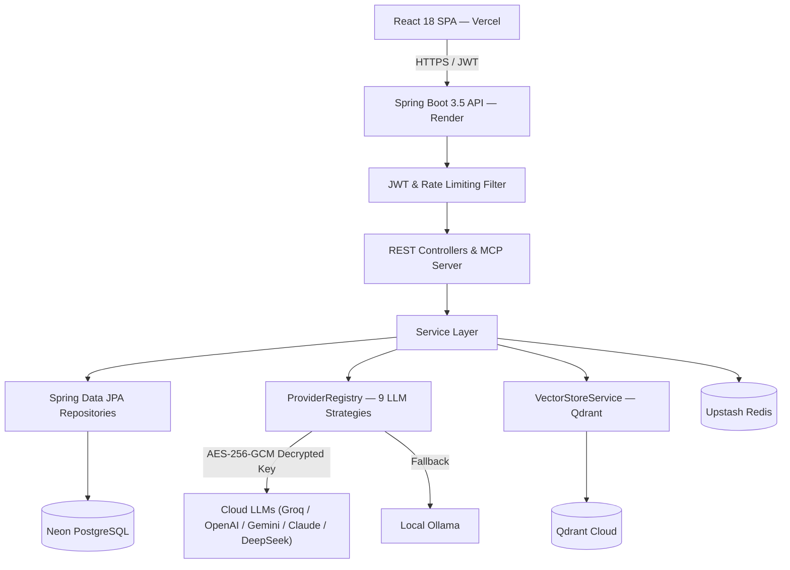

# 🎓 AI School Management & Analytics Platform

[](https://spring.io/projects/spring-boot)
[](https://react.dev/)
[](https://www.oracle.com/java/)
[](https://vitejs.dev/)
[](LICENSE)

Enterprise-grade School Management & RAG Platform featuring multi-provider LLM orchestration, Qdrant vector search, Model Context Protocol (MCP) server, and role-based academic administration.

---

## 🌐 Live Deployments

| Service | Platform | URL |
| :--- | :--- | :--- |
| **Frontend SPA** | Vercel | [https://aischoolsystem.vercel.app](https://aischoolsystem.vercel.app) |
| **Backend REST API** | Render | [https://ai-school-management-system-l0a0.onrender.com](https://ai-school-management-system-l0a0.onrender.com) |
| **Database** | Neon Cloud | Serverless PostgreSQL 16+ |
| **Cache & Rate Limit** | Upstash Redis | Serverless Redis (TLS) |
| **Vector Store** | Qdrant Cloud | `course_documents` (768-dim) |

---

## ⚡ Key Capabilities

- **Academic Operations**: Multi-tenant schools, courses, teacher allocations, student enrollments, assignments, and digital gradebooks.
- **Multi-Provider AI (LangChain4j)**: Dynamic routing to 9 LLM providers (Groq, OpenAI, Gemini, Anthropic, OpenRouter, Azure, DeepSeek, Mistral, Ollama). No local GPU required.
- **RAG & Vector Search**: Document chunking and semantic search over course syllabi via Qdrant Cloud (`nomic-embed-text`, 768 dimensions).
- **Model Context Protocol (MCP)**: Native MCP Server (`/mcp/sse`, `/mcp/message`) with JSON-RPC 2.0 and 4 RBAC-governed tools for Claude Desktop, Cursor, and autonomous agents.
- **Natural-Language-to-SQL**: Safe query engine over demo student analytics guarded by JSqlParser (`SqlValidator`).
- **Security & Privacy**: Stateless JWT (24h validity), AES-256-GCM encryption for stored user API keys, Upstash Redis rate limiting, and RBAC across 5 distinct roles.
- **Modern UI/UX**: Pitch-black monochrome design system (`#000000`), glassmorphic cards, collapsible sidebar (`Ctrl+B`), and dark/light modes.

---

## 🏗️ Architecture



---

## 🛠️ Technology Stack

| Layer | Technologies | Version |
| :--- | :--- | :--- |
| **Frontend** | React, Vite, React Router, Bootstrap, Chart.js, Lucide Icons | 18.x / 5.x |
| **Backend** | Java, Spring Boot, Spring Security, Spring Data JPA | Java 17 / 3.5.x |
| **AI & RAG** | LangChain4j, Qdrant Cloud, nomic-embed-text (768-dim) | 0.34.0 |
| **MCP** | Model Context Protocol Server (SSE + JSON-RPC 2.0) | 2024-11-05 |
| **Data & Cache** | PostgreSQL (Neon), Redis (Upstash) | PG 16+ / Redis 7+ |

---

## 🚀 Quick Start

### 1. Clone Repository
```bash
git clone https://github.com/Dheerajdvn/AI-School-Management-System.git
cd AI-School-Management-System
```

### 2. Launch Local Dependencies (Optional)
```bash
docker-compose up -d
```

### 3. Start Backend
```bash
cd backend
mvn spring-boot:run
```
*Required environment variable:*
```bash
export APP_ENCRYPTION_KEY="your-32-char-minimum-secret-key"
```

### 4. Start Frontend
```bash
cd frontend
npm install
npm run dev
# App opens at http://localhost:5173
```

### 5. Demo Accounts
| Role | Username | Password |
| :--- | :--- | :--- |
| **Admin** | `admin` | `password123` |
| **Principal** | `principal` | `password123` |
| **Teacher** | `teacher` | `password123` |
| **Student** | `student` | `password123` |

*Configure AI provider (e.g. Groq, OpenAI) under **AI Settings** (`/settings`).*

---

## ⚙️ Environment Variables

| Variable | Description | Production Target |
| :--- | :--- | :--- |
| `SPRING_PROFILES_ACTIVE` | Active profile (`dev` or `prod`) | `prod` |
| `SPRING_DATASOURCE_URL` | PostgreSQL JDBC connection URL | Neon SSL connection string |
| `SPRING_DATASOURCE_USERNAME` | Database username | Neon user |
| `SPRING_DATASOURCE_PASSWORD` | Database password | Neon password |
| `SPRING_REDIS_HOST` | Redis host | Upstash Redis host |
| `SPRING_REDIS_PORT` | Redis port | `6379` |
| `SPRING_REDIS_PASSWORD` | Redis authentication token | Upstash password |
| `SPRING_REDIS_SSL` | Enable Redis TLS | `true` |
| `QDRANT_HOST` | Qdrant host or cloud endpoint | Qdrant Cloud URL |
| `QDRANT_API_KEY` | Qdrant Cloud API key | Qdrant API key |
| `CORS_ALLOWED_ORIGINS` | Allowed CORS origins | `https://aischoolsystem.vercel.app` |
| `JWT_SECRET` | JWT token signature secret | Random 256-bit key |
| `APP_ENCRYPTION_KEY` | AES-256-GCM key (min 32 characters, **required**) | `openssl rand -base64 32` |
| `JAVA_OPTS` | JVM memory constraint (Render free-tier) | `-Xmx320m -Xms256m -XX:+UseG1GC -XX:+ExitOnOutOfMemoryError` |

---

## 📡 Core API Endpoints

- **Authentication**: `POST /api/auth/login`, `POST /api/auth/refresh`, `GET /api/auth/me`
- **AI Settings**: `GET /api/ai/config`, `POST /api/ai/config`, `POST /api/ai/config/verify`
- **AI RAG Chat**: `POST /api/ai/chat` (SSE Streaming)
- **Natural Language SQL**: `POST /api/ai/ask` (Guarded via `SqlValidator`)
- **MCP Server**: `GET /mcp/sse`, `POST /mcp/message?sessionId={id}`
- **Academics**: `/api/admin/schools`, `/api/students`, `/api/courses`, `/api/documents`
- **Health**: `GET /api/actuator/health`

---

## 📚 Documentation Index

- 🏗️ **[Architecture Overview (`Architecture.md`)](Architecture.md)**: System layout, package structure, security sequence, and UI theme architecture.
- 🔌 **[MCP Server Guide (`MCP.md`)](MCP.md)**: Protocol endpoints, tool definitions, RBAC matrix, and agentic dispatching.
- 🤖 **[AI & RAG Pipeline (`AI.md`)](AI.md)**: Multi-provider strategies, prompt templates, vector search, and SQL validation.
- 🗄️ **[Database Schema (`Database.md`)](Database.md)**: Entity models, table indexes, ER diagrams, and student dataset scope.
- 🚀 **[Deployment Guide (`Deployment.md`)](Deployment.md)**: Vercel, Render, Neon DB, and Jenkins CI/CD configurations.
- 🛠️ **[Developer Guide (`DeveloperGuide.md`)](DeveloperGuide.md)**: Coding standards, adding LLM providers, adding MCP tools, and theme guidelines.
- 🔧 **[Troubleshooting Guide (`Troubleshooting.md`)](Troubleshooting.md)**: Fixes for Render OOM, encryption keys, login themes, and sidebar shortcuts.
- 📋 **[Audit Report (`AUDIT_REPORT.md`)](AUDIT_REPORT.md)**: Security, test coverage, and production readiness tracking.
- 📄 **[Project Summary (`PROJECT_SUMMARY.md`)](PROJECT_SUMMARY.md)**: High-level architectural recap and roadmap.

---

## 📄 License & Author

- **License**: MIT
- **Author**: Dheeraj DVN ([@Dheerajdvn](https://github.com/Dheerajdvn))
