# 🎓 AI School Management & Analytics Platform

[](https://spring.io/projects/spring-boot)
[](https://react.dev/)
[](https://www.oracle.com/java/)
[](https://opensource.org/licenses/MIT)

> *An enterprise-grade, AI-powered School Management System featuring Retrieval-Augmented Generation (RAG), intelligent chatbots, lesson planners, role-based access control, and comprehensive academic analytics.*

---

## 2. Project Overview

### What Problem This Solves
Managing educational institutions requires handling complex administrative workflows—student records, teacher allocations, course enrollments, gradebooks, and document management—while modern educators increasingly demand AI assistance for lesson planning, quizzing, and document search. Traditional school management systems lack native artificial intelligence capabilities, requiring disjointed third-party plugins.

### Why It Was Built
This platform was built to demonstrate how enterprise-grade Java architectures (`Spring Boot`) and modern frontend SPAs (`React`) can be seamlessly integrated with cutting-edge AI pipelines (`Spring AI`, `LangChain4j`, `Ollama`, and `Qdrant`) to provide a unified, secure, and intelligent school administration ecosystem.

### Who Can Use It
- **Super Admins / Platform Owners**: Manage multi-tenant schools, system users, subscriptions, and platform-wide analytics.
- **School Admins**: Oversee individual school operations, classes, sections, subjects, teachers, and students.
- **Principals**: Monitor institutional performance analytics, attendance trends, financial reports, and risk detection.
- **Teachers**: Manage classrooms, mark attendance registers, grade assignments, generate AI quizzes and lesson plans, and upload study materials.
- **Students**: Track course progress, submit assignments, interact with AI tutors, practice quizzes, and view academic grades.
- **Parents**: Review children's academic performance reports, track attendance statistics, pay school fees, and communicate with teachers.

### Key Objectives
- Centralize school administrative and academic operations.
- Provide secure, stateless JWT-based multi-role authentication.
- Integrate local AI models (via Ollama) and vector databases (via Qdrant) for privacy-first Retrieval-Augmented Generation (RAG).

---

## 3. Project Features

### 🔐 Authentication & Security
- Stateless JWT Authentication with refresh token support.
- Role-Based Access Control (RBAC) supporting `ROLE_SUPER_ADMIN`, `ROLE_ADMIN`, `ROLE_SCHOOL_ADMIN`, `ROLE_TEACHER`, and `ROLE_STUDENT`.
- BCrypt password encryption and method-level security (`@PreAuthorize`).

### 🏫 School & Academic Management
- Multi-tenant School Onboarding with automated School Admin account provisioning.
- Student & Teacher Record Management with advanced pagination, search, and sorting.
- Course Offerings, Teacher Assignments, and Student Enrollments.

### 📋 Teacher Utilities
- **Gradebook Manager**: Automated grade converters, student average calculations, LocalStorage persistence, and PDF/CSV exporter tools.
- **Attendance Register**: Daily registers with single-action status switches and bulk markers.
- **AI Lesson Planner**: Generate structures and outlines based on topic targets.
- **AI Quiz Generator**: Draft dynamic question sheets instantly with multiple options and correct answer selectors.

### 📊 Dashboard & Analytics
- Real-time statistics cards showing total users, students, teachers, courses, documents, and AI chats.
- Interactive Chart.js and custom CSS visualizations for student enrollment by course, user growth, and document uploads.

### 🤖 AI Features & RAG
- **AI Chat Assistant**: Context-aware RAG assistant powered by Ollama and Qdrant.
- **Document Processing**: Upload PDFs and documents for automated chunking, embedding generation, and vector indexing.
- **AI Tools**: Dedicated AI Lesson Planner and Quiz Generator for educators.

---

## 4. System Architecture

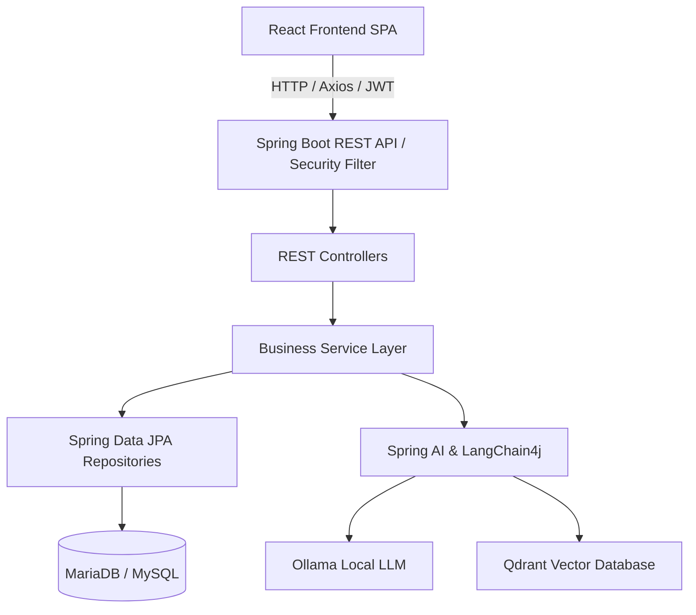

---

## 5. Project Structure

### Backend Structure (`backend/`)
```text
backend/
│
├── src/main/java/com/ai/dashboard/
│   ├── ai/               # AI & RAG integrations (chat, embeddings, prompts, vector search)
│   ├── config/           # Spring configurations (security, async, initializers, demo data)
│   ├── controller/       # REST API controllers
│   ├── document/         # Document management & storage processing
│   ├── dto/              # Data Transfer Objects & Response wrappers
│   ├── entity/           # JPA persistent domain entities
│   ├── exception/        # Global exception handling & custom exceptions
│   ├── repository/       # Spring Data JPA repositories & Specifications
│   ├── security/         # JWT filter, token provider & user details service
│   ├── service/          # Business logic interfaces and implementations
│   └── util/             # Utility and helper classes
└── src/main/resources/   # Application YAML config, schema SQL, migrations
```

### Frontend Structure (`frontend/`)
```text
frontend/
│
├── src/
│   ├── api/              # Specific API integration clients
│   ├── components/       # Reusable UI components (tables, modals, cards, charts)
│   ├── constants/        # Routes, API endpoints, permissions, and roles
│   ├── context/          # React Context providers (Auth, Toast, Query)
│   ├── hooks/            # Custom React hooks (WebSockets, notifications, toast)
│   ├── layouts/          # Protected and public route layouts
│   ├── pages/            # View pages grouped by portal (Admin, School, Teacher, Student, AI)
│   ├── services/         # Core API services and Axios interceptors
│   └── utils/            # Formatting and token storage helpers
```

---

## 6. Technology Stack

| Category | Technology | Version | Description |
| :--- | :--- | :--- | :--- |
| **Frontend** | React | 18.x | Single Page Application framework |
| | React Router | 6.x | Client-side routing and protected layouts |
| | Bootstrap | 5.x | Responsive styling and UI components |
| | Chart.js | 4.x | Data visualization and analytics charts |
| **Backend** | Java | 21 | Enterprise programming language |
| | Spring Boot | 3.x | Rapid application development framework |
| | Spring Data JPA | 3.x | Object-Relational Mapping & repositories |
| | Spring Security | 6.x | Authentication and method security |
| **Database** | PostgreSQL | 15.x+ | Relational data persistence |
| | H2 Database | Latest | In-memory database for unit/integration testing |
| **AI & Search** | Spring AI / LangChain4j | Latest | LLM abstraction and orchestration framework |
| | Ollama | Latest | Local LLM runner (e.g. `qwen2.5:7b` / `llama3`) |
| | Qdrant | Latest | Vector database for semantic RAG search |
| **Tooling** | Maven | Latest | Java build and dependency management |
| | Vite | Latest | Frontend build tool and dev server |

---

## 7. Prerequisites

Ensure you have the following installed on your system:
- **Java Development Kit (JDK) 21**
- **Node.js (v18+) & npm**
- **Docker Desktop** (for local databases and cache engines)
- **Ollama** (for local AI features)

---

## 8. Installation Guide

### Step 1: Clone the Repository
```bash
git clone https://github.com/dheerajdvn/ai-school-management-platform.git
cd ai-school-management-platform
```

### Step 2: Spin Up Local Services (Docker Compose)
We use Docker Compose to run local PostgreSQL, Redis, and Qdrant instances:
```bash
docker-compose up -d
```
This starts:
- **PostgreSQL** on port `5432` (with database `schooldb`)
- **Redis** on port `6379`
- **Qdrant** on port `6333`

### Step 3: Run Ollama & Pull Models
Ensure Ollama is running on your host machine and pull the required models:
```bash
# Pull the target code model
ollama pull qwen2.5-coder:3b

# Pull the target embedding model
ollama pull nomic-embed-text
```

### Step 4: Run the Spring Boot Backend
Navigate to the `backend` directory and start the application. By default, it will launch under the **`dev`** profile:
```bash
cd backend
./mvnw clean spring-boot:run
```
*(On Windows PowerShell, use `mvnw.cmd spring-boot:run`)*

### Step 5: Start the React Frontend
Open a new terminal window, navigate to the `frontend` folder, initialize packages, and start the Vite dev server:
```bash
cd frontend
npm install
npm run dev
```

### Step 6: Access the Application
Open your browser and navigate to `http://localhost:5173`. Log in with default admin credentials:
*   **Username**: `dheerajdvn`
*   **Password**: `root@123`

---

## 9. Environment Variables & Spring Profiles

### Spring Boot Profiles
The backend utilizes standard environment profiles for clean deployment separation:
- **`dev` (Active by Default)**: Binds to local docker services with safe, zero-config fallbacks.
- **`prod` (Production)**: Strict profile activated via Render environments. Forces configuration bindings directly from Render properties without hardcoded backups.

### Required Environment Properties

| Variable | Description | Development Default | Production Target |
| :--- | :--- | :--- | :--- |
| `SPRING_PROFILES_ACTIVE` | Active Spring profile | `dev` | `prod` (Mandatory on Render) |
| `SPRING_DATASOURCE_URL` | PostgreSQL connection URL | `jdbc:postgresql://localhost:5432/schooldb` | Render Neon PostgreSQL URI |
| `SPRING_DATASOURCE_USERNAME` | Database username | `postgres` | Neon Owner Username |
| `SPRING_DATASOURCE_PASSWORD` | Database password | `postgres` | Neon Owner Password |
| `SPRING_REDIS_HOST` | Redis host server | `localhost` | Production Redis Endpoint |
| `SPRING_REDIS_PORT` | Redis server port | `6379` | Production Redis Port |
| `JWT_SECRET` | Key for signing security tokens | Auto-generated local key | Cryptographically random secret |
| `OLLAMA_BASE_URL` | Ollama service endpoint | `http://localhost:11434` | Render Ollama Host |
| `QDRANT_HOST` | Qdrant host server | `localhost` | Production Qdrant Host |
| `QDRANT_PORT` | Qdrant server port | `6333` | Production Qdrant Port |

---

## 10. API Documentation

### Important Endpoints
- **Authentication**: `POST /api/auth/login`, `POST /api/auth/refresh`
- **Schools**: `GET /api/admin/schools`, `POST /api/admin/schools`, `PUT /api/admin/schools/{id}`
- **Students**: `GET /api/students`, `POST /api/students`, `PUT /api/students/{id}`
- **Courses**: `GET /api/courses`, `POST /api/courses`, `PUT /api/courses/{id}`
- **Dashboard**: `GET /api/dashboard/totals`, `GET /api/dashboard/enrollment-by-course`
- **AI RAG Chat**: `POST /api/ai/chat`

---

## 11. Database Schema

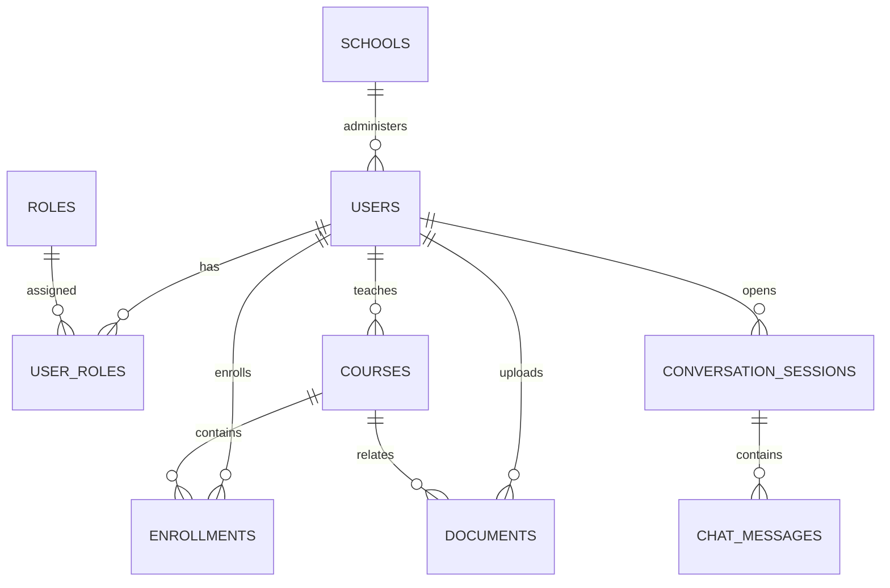

---

## 12. AI Workflow (RAG Pipeline)

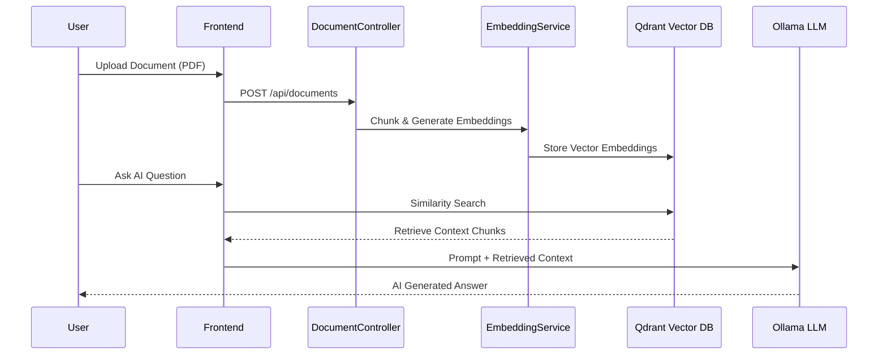

---

## 13. System Screenshots

Here are a few representative screenshots of the application:

## 📸 System Screenshots

The following screenshots showcase the major modules of **AI School Management & Analytics Platform**.

---

### 🌐 Landing Page


A modern AI-powered landing page showcasing the platform's capabilities, features, and enterprise-grade design.

---

### 🔐 Login

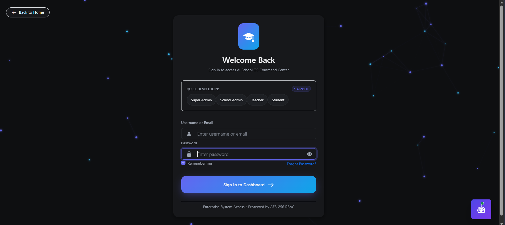

Secure JWT-based authentication with Role-Based Access Control (RBAC).

---

### 📊 School Admin Dashboard


Centralized dashboard for managing schools, users, courses, analytics, and AI-powered insights.

---

### 👨‍💼 Admin Dashboard

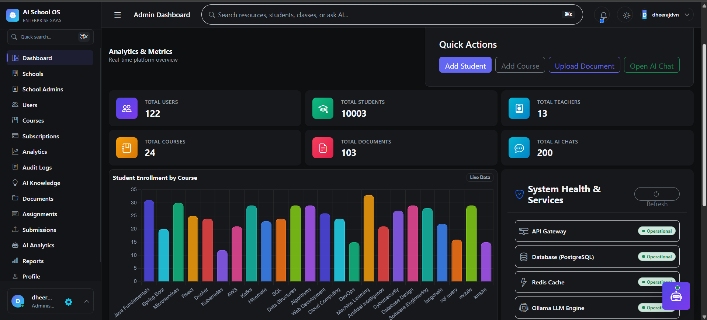

Platform administration with user management, subscriptions, reports, and system monitoring.

---

### 👨‍🏫 Teacher Dashboard

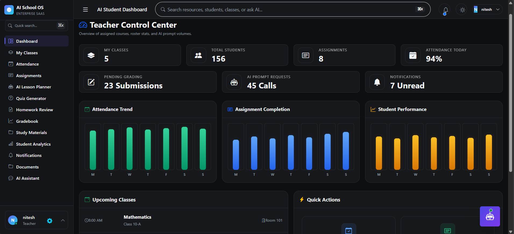

Teachers can manage classes, attendance, assignments, exams, grades, lesson planning, and analytics.

---

### 👨‍🎓 Student Dashboard

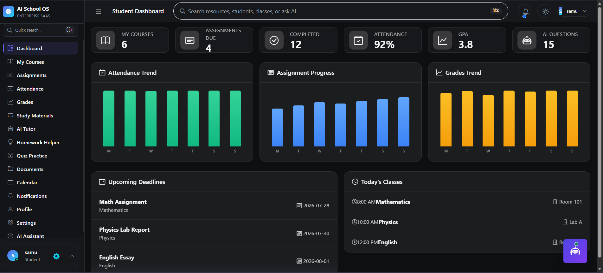

Students can view courses, assignments, attendance, grades, schedules, and AI-powered learning tools.

---

### 🤖 AI Chat Assistant (RAG)


Enterprise AI Assistant powered by Spring AI, Ollama, LangChain4j, and Qdrant for Retrieval-Augmented Generation (RAG).

---

### 🧠 AI Quiz Generator

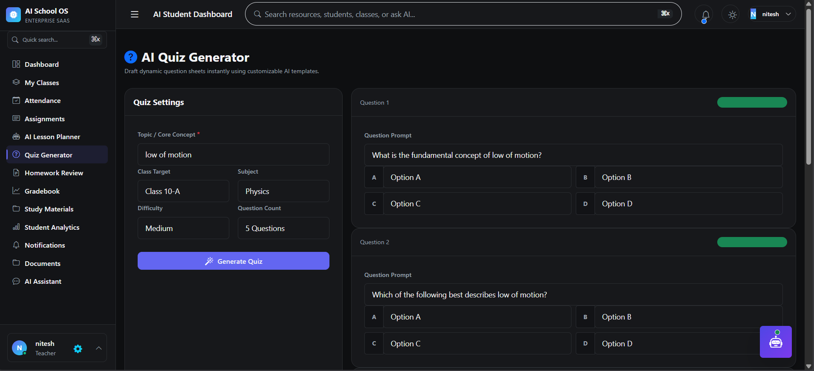

Generate quizzes instantly using AI with configurable difficulty levels and question types.

---

### 📈 Analytics Dashboard

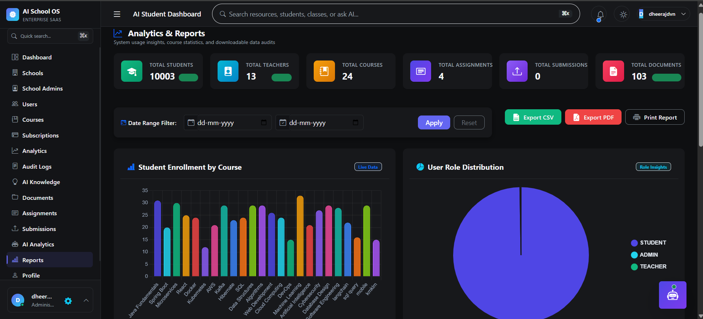

Interactive dashboards with charts, KPIs, and real-time academic analytics.

---

### 📚 Knowledge Dashboard

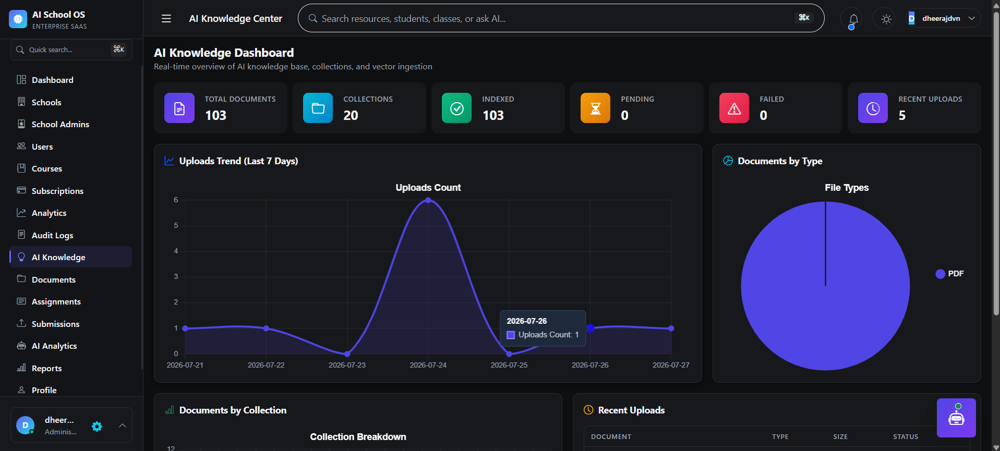

Manage uploaded documents, vector embeddings, and AI knowledge sources.

---

### 📝 Attendance Management

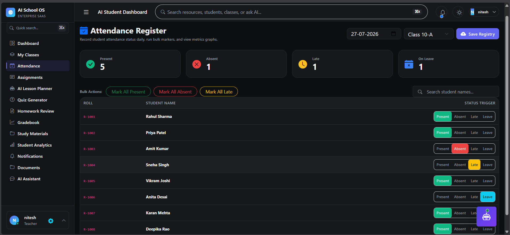

Digital attendance tracking with role-based access and reporting.


---

## 14. Security
- **Stateless JWT**: Tokens validated on every secured request.
- **Role-Based Access Control**: Method-level `@PreAuthorize` guards restricting admin and teacher operations.
- **Password Encryption**: BCrypt hashing ensuring zero plain-text password exposure.

---

## 15. Testing
- **Backend Tests**: Run JUnit 5 & Mockito test suites via Maven:
  ```bash
  cd backend
  ./mvnw test
  ```

---

## 16. Future Enhancements
- Kubernetes deployment manifests and Helm charts.
- Advanced multi-tenant school isolation with schema-per-tenant support.
- Real-time video conferencing integration for virtual classrooms.

---

## 17. Troubleshooting
- **Database Connection Error**: Verify your local Docker container `ai-dashboard-db` is running via `docker ps`. If running manually, verify credentials in `application-dev.yml` match your instance.
- **Ollama Connection Refused**: Ensure the Ollama client is active in your taskbar, or run `ollama serve`. Verify you pulled `qwen2.5-coder:3b` and `nomic-embed-text`.
- **Qdrant Connection Error**: Ensure the Qdrant container `ai-dashboard-qdrant` is active on port `6333`.

---

## 18. Contributing
Contributions are welcome! Please fork the repository and submit a Pull Request.

---

## 19. License
This project is licensed under the [MIT License](LICENSE).

---

## 20. Author
- **Dheeraj DVN**
- GitHub: [@dheerajdvn](https://github.com/dheerajdvn)
- Email: dheerajdvn@gmail.com

---

## 21. Acknowledgements
- [Spring Boot](https://spring.io/projects/spring-boot)
- [React](https://react.dev/)
- [Spring AI & LangChain4j](https://github.com/langchain4j/langchain4j)
- [Ollama](https://ollama.com/)
- [Qdrant](https://qdrant.tech/)
- Open Source Community
